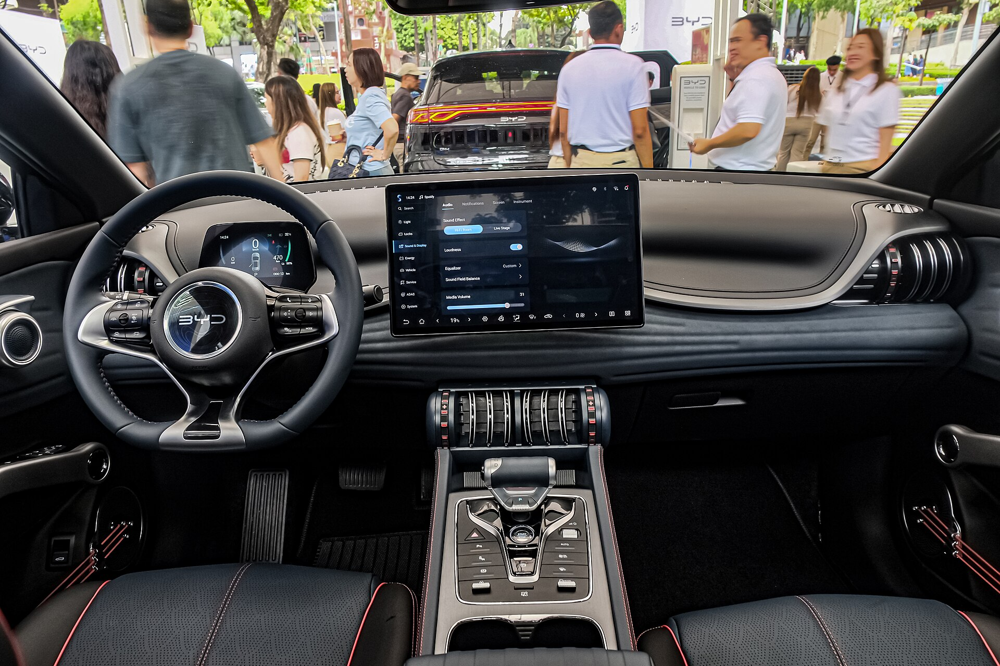

## מה הופך את BYD Atto 3 לבחירה מעניינת בישראל?

BYD Atto 3 הוא אחד הרכבים החשמליים הסיניים שכבשו את ליבו של הקהל הישראלי בשנים האחרונות, והפך לאחד הדגמים הנמכרים בקטגוריית הקרוסאוברים החשמליים הקומפקטיים. מדובר ברכב משפחתי חשמלי במלואו, שמציע שילוב אטרקטיבי של טווח סביר, מרחב פנימי נדיב ומחיר שנחשב תחרותי מול המתחרים האירופיים והיפניים. במבחן הדרך שלנו בדקנו האם BYD Atto 3 מצליח לתרגם את הצלחתו המסחרית לחוויית נהיגה אמיתית.

מבחינת ממדים, הרכב ממוקם בקטגוריה שמזכירה את יונדאי קונה ואת קיה נירו, אך עם דגש ברור על מרחב פנימי ותחושת חלל. הרושם הראשוני מבחוץ הוא של קרוסאובר עכשווי, עם קווים מעוגלים, פנסים חדים ומראה בוגר יותר משהיה מקובל אצל יצרנים סיניים בעבר.

## איך נוהג BYD Atto 3 בכביש?

מתחת למכסה המנוע — או ליתר דיוק, על הסרן הקדמי — יושב מנוע חשמלי יחיד המפיק כוח של כ-201 כוחות סוס ומומנט מיידי. הביצועים אינם ספורטיביים בהגדרתם, אך התאוצה החלקה והשקטה מספקת בהחלט לנהיגה עירונית ובין-עירונית. הזינוק מ-0 ל-100 קמ"ש מתבצע בכ-7.3 שניות, נתון סביר לחלוטין עבור קרוסאובר משפחתי.

ההיגוי קליל ומדויק דיו לתמרונים בעיר, אך חובבי נהיגה דינמית עשויים למצוא אותו מעט מנותק. המתלים מכוילים לנוחות, ובולעים היטב את מרבית מפגעי הכביש הישראלי, כולל פסי האטה ובורות. ברכב חשמלי כבד יחסית מורגשת נטייה קלה להתנדנדות בסיבובים חדים, אך בשימוש יומיומי הדבר כמעט אינו מפריע.

### כמה טווח באמת מקבלים?

הטווח המוצהר עומד על כ-420 קילומטר במחזור המדידה האירופי WLTP. בשימוש מעורב אמיתי בישראל, בעיקר בנהיגה עירונית עם מיזוג פעיל, ניתן לצפות לטווח מעשי של כ-330 עד 380 קילומטר. בנהיגה חסכנית וללא עומסים, הרכב מסוגל להתקרב לנתון המוצהר.

יתרון בולט הוא סוללת ה-Blade הייחודית של BYD, המבוססת על כימיית ליתיום ברזל פוספט (LFP). סוללה זו נחשבת בטוחה יותר, עמידה יותר לאורך זמן, וסובלת פחות מהתנוונות גם כאשר טוענים אותה ל-100% באופן קבוע.

## פנים הרכב: נועז ומפתיע

תא הנוסעים של BYD Atto 3 הוא ללא ספק אחד ממוקדי העניין הגדולים ברכב. העיצוב נועז, צבעוני ובלתי שגרתי — כולל מיתרים בדלתות שנמתחים כמו מיתרי גיטרה (אלמנט עיצובי מדובר), ידיות אחיזה בעיצוב ייחודי, ומגוון חומרים בגימור איכותי.

במרכז הדשבורד בולט מסך מולטימדיה גדול המסתובב אוטומטית בין מצב לרוחב למצב לאורך בלחיצת כפתור — גימיק שעובד היטב ומושך תשומת לב. מערכת המולטימדיה עשירה, אם כי לעיתים דורשת התרגלות בשל ריבוי התפריטים.

המרחב האחורי נדיב, ומספק מקום נוח לשלושה נוסעים מבוגרים לנסיעות ארוכות. תא המטען בנפח של כ-440 ליטר מספק לצרכים משפחתיים יומיומיים.

## טבלת השוואה: BYD Atto 3 מול מתחרים

| פרמטר | BYD Atto 3 | קיה נירו חשמלי | יונדאי קונה חשמלי |
|---|---|---|---|
| הספק (כ"ס) | כ-201 | כ-204 | כ-218 |
| טווח WLTP | כ-420 ק"מ | כ-460 ק"מ | כ-514 ק"מ |
| סוג סוללה | LFP (Blade) | ליתיום-יון | ליתיום-יון |
| נפח תא מטען | כ-440 ליטר | כ-475 ליטר | כ-466 ליטר |
| 0-100 קמ"ש | כ-7.3 שניות | כ-7.8 שניות | כ-7.9 שניות |

## בטיחות ומערכות עזר לנהג

BYD Atto 3 מגיע עם חבילת בטיחות עשירה הכוללת בקרת שיוט אדפטיבית, בלימת חירום אוטומטית, שמירת נתיב, זיהוי הולכי רגל ומערכת ניטור שטח מת. הרכב זכה בציון מלא של חמישה כוכבים במבחני הבטיחות האירופיים Euro NCAP, נתון מרשים המעיד על התקדמות היצרנים הסיניים בתחום זה.

חלק מהמערכות, בדומה לרכבים חשמליים רבים אחרים, נוטות להיות "רגישות" מדי ולהתריע לעיתים קרובות, אך ניתן לכוונן חלק מהן לפי העדפה אישית.

## מחיר ותחזוקה בישראל

מחיר BYD Atto 3 בישראל נחשב תחרותי ביחס לרמת האבזור והמרחב שהוא מציע, וממוקם בטווח שמאתגר ישירות את המתחרים הקוריאניים. עם זאת, חשוב לזכור כי מס הקנייה על רכבים חשמליים צפוי לעלות בהדרגה בשנים הקרובות, ולכן כדאי לבדוק את המחיר המעודכן מול היבואן הרשמי לפני רכישה.

מבחינת תחזוקה, רכב חשמלי דורש פחות טיפולים תקופתיים מרכב בנזין, והעלויות השוטפות נמוכות יותר. רשת השירות של BYD בישראל התרחבה משמעותית, מה שמעניק שקט נפשי רב יותר לרוכשים.

## סיכום: למי מתאים BYD Atto 3?

BYD Atto 3 הוא הצעה משכנעת עבור משפחות המחפשות מעבר לרכב חשמלי במחיר הגיוני, ללא ויתור על מרחב, אבזור ובטיחות. הוא אולי אינו הספורטיבי בקטגוריה ואינו בעל הטווח הארוך ביותר, אך השילוב של סוללת Blade העמידה, עיצוב פנים ייחודי ומחיר תחרותי הופך אותו לבחירה ראויה מאוד בשוק החשמלי הישראלי הצומח.
