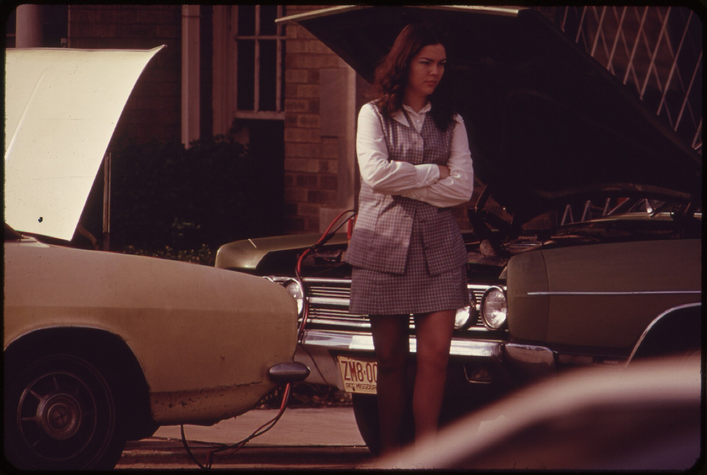

אם הרכב שלכם מתקשה להתניע בבוקר, האורות נראים עמומים או שנורת המצבר נדלקת בלוח המחוונים — ייתכן שהמצבר מתקרב לסוף חייו. **מצבר רכב** ממוצע מחזיק בישראל כשלוש עד חמש שנים בלבד, והחום הכבד של הקיץ הישראלי הוא אחד הגורמים המרכזיים לשחיקה מוקדמת. בכתבה הזו נסקור את סימני האזהרה החשובים, מתי כדאי להחליף, ואיך להאריך את חיי המצבר.

## מהם הסימנים שהמצבר עומד למות?

זיהוי מוקדם של מצבר חלש יכול לחסוך לכם תקיעה מביכה בצד הדרך. הנה שבעת הסימנים הנפוצים ביותר:

1. **התנעה איטית או מתקשה** — כשמנוע ההתנעה מסתובב לאט או "מתאמץ", זהו הסימן הקלאסי ביותר.
2. **אורות עמומים** — פנסי הרכב ותאורת לוח המחוונים נראים חלשים מהרגיל, במיוחד במצב רבע.
3. **נורת מצבר דולקת** — נורת האזהרה בצורת מצבר בלוח המחוונים מעידה על בעיה במערכת הטעינה.
4. **צליל נקישה בהתנעה** — כשמסובבים את המפתח ונשמע רק "קליק" ללא התנעה.
5. **מערכות חשמל מתנהגות מוזר** — חלונות חשמליים איטיים, מולטימדיה שנכבית, או שעון שמתאפס.
6. **מצבר תפוח או דולף** — נפיחות בגוף המצבר או שאריות ריכוך לבנבנות סביב הקטבים.
7. **גיל המצבר** — אם עברו יותר מארבע שנים, הסיכון עולה משמעותית גם ללא סימנים ברורים.

## כמה זמן מחזיק מצבר רכב בישראל?

התשובה תלויה בעיקר בתנאי השימוש ובאקלים. בניגוד לתפיסה הרווחת, דווקא **החום הישראלי** מזיק למצבר יותר מהקור. טמפרטורות גבוהות מאיצות את התאדות הנוזל הפנימי ומקצרות את חיי המצבר. נסיעות קצרות ותכופות, שבהן המצבר לא מספיק להיטען במלואו, גם הן מקצרות את אורך חייו.

| גורם | השפעה על המצבר |
|---|---|
| חום קיץ קיצוני | שחיקה מואצת, התאדות נוזלים |
| נסיעות קצרות בלבד | טעינה חלקית, קיצור חיים |
| רכב שעומד ללא שימוש | פריקה עצמית הדרגתית |
| מערכות חשמל רבות | עומס גבוה על המצבר |
| תחזוקה שוטפת ובדיקות | הארכת חיים משמעותית |

## איך מאריכים את חיי המצבר?

מספר הרגלים פשוטים יכולים להוסיף חודשים ואף שנים לחיי המצבר:

- **נסעו נסיעות ארוכות מדי פעם** כדי לאפשר טעינה מלאה, במיוחד אם אתם נוהגים בעיקר מרחקים קצרים.
- **שמרו על ניקיון הקטבים** — פינוי חלודה וריכוך משפר את המגע החשמלי.
- **וודאו שהמצבר מהודק היטב** — רטט מוגזם פוגע ברכיבים הפנימיים.
- **כבו צרכני חשמל** לפני כיבוי המנוע, כמו מזגן ומערכת שמע.
- **אם הרכב עומד לתקופה ארוכה**, שקלו מטען תחזוקה (טריקל צ'ארג'ר).

### מה עושים כשהמצבר כבר מת?

אם נתקעתם עם מצבר ריק, ניתן לבצע **התנעת שרשרת** ("ג'אמפ") באמצעות כבלי חיבור לרכב אחר. חשוב לחבר נכון: אדום לחיובי, שחור לשלילי, ולהתחיל מהרכב התקין. עם זאת, התנעת שרשרת היא פתרון זמני בלבד — אם המצבר ישן, כדאי להחליף אותו בהקדם.

## מתי כדאי לבדוק את המצבר?

מומלץ לבצע **בדיקת מצבר** לפני תחילת הקיץ ולפני החורף. הבדיקה במוסך מהירה, לוקחת דקות ספורות, ולעיתים ניתנת ללא עלות. הבדיקה מודדת את מתח המצבר ואת יכולת ההתנעה שלו, ומאפשרת לזהות בעיות לפני שהן הופכות לתקיעה מלאה. אם הרכב שלכם עבר את גיל שלוש שנים, בדיקה תקופתית היא השקעה קטנה שמונעת כאב ראש גדול.

זכרו: מצבר תקין הוא הבסיס לכל מערכות הרכב. השקעה קטנה בתחזוקה ובזיהוי מוקדם של סימני אזהרה תחסוך לכם כסף, זמן ולא מעט עצבים.
