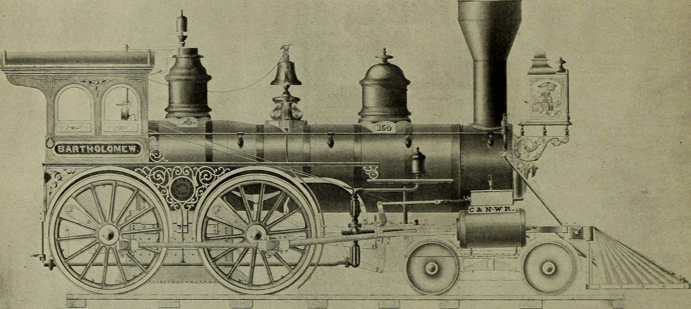

החלפת שמן מנוע היא הטיפול הזול, הפשוט והחשוב ביותר לשמירה על אורך חיי המנוע — וברוב הרכבים המודרניים היום, עם שמן סינתטי מלא, מרווח ההחלפה נע בין **10,000 ל-15,000 קילומטר** או אחת לשנה, לפי מה שמגיע קודם. עם זאת, המספר המדויק תלוי בסוג הרכב, בסוג השמן ובעיקר בתנאי הנהיגה שלכם — ובישראל התנאים לא תמיד מקלים על המנוע.

## למה בכלל צריך להחליף שמן מנוע?

שמן המנוע ממלא כמה תפקידים קריטיים בו-זמנית: הוא מסכך את החלקים הנעים, מסייע בקירור, מנקה משקעים ומונע קורוזיה. עם הזמן השמן מתבלה — תוספי הביצועים שבו מתכלים, הוא נאסף חלקיקי פיח ומתכת, ואיבד מיכולת הסיכוך שלו. שמן ישן ומזוהם מגביר את החיכוך, מעלה את צריכת הדלק ובמקרים קיצוניים גורם לנזק בלתי הפיך.

## כל כמה קילומטר להחליף שמן מנוע?

התשובה הכי נכונה נמצאת ב**ספר הרכב** של היצרן. יחד עם זאת, אפשר לתת כללי אצבע לפי סוג השמן:

| סוג שמן | מרווח החלפה מקובל | מתאים ל |
|---|---|---|
| שמן מינרלי | 5,000–7,000 ק"מ | רכבים ותיקים, מנועים פשוטים |
| שמן חצי-סינתטי | 7,000–10,000 ק"מ | רכבים בני 10–15 שנה |
| שמן סינתטי מלא | 10,000–15,000 ק"מ | רוב הרכבים החדשים |

חשוב לזכור שגם אם לא הגעתם לקילומטראז' — מומלץ להחליף שמן **לפחות אחת לשנה**. השמן מתיישן גם כשהרכב עומד, בגלל לחות ותהליכי חמצון.

## למה האקלים בישראל משנה את החישוב?

התנאים בישראל נחשבים ל"נהיגה מאומצת" גם אם לא מרגישים כך:

- **חום קיצוני** בקיץ מאיץ את התבלות השמן.
- **נסיעות קצרות עירוניות** לא מאפשרות למנוע להגיע לטמפרטורת עבודה מלאה, מה שמצטבר לחות ומזהמים בשמן.
- **אבק וחול**, במיוחד באזורי הדרום, מגדילים את העומס על מערכת הסינון.

בתנאים כאלה, אם אתם נוסעים בעיקר בעיר במרחקים קצרים, שקלו לקצר את מרווח ההחלפה בכ-20% מהמומלץ ביצרן.

## אל תשכחו את מסנן השמן

כל החלפת שמן חייבת לכלול **החלפת מסנן שמן (פילטר)**. אין טעם לצקת שמן חדש ולהשאיר מסנן סתום ומלא במזהמים ישנים — הם יזהמו את השמן החדש כמעט מיד. זה חלק זול, וכל מוסך מחליף אותו כחלק מהשירות.

## איך לבדוק את מצב השמן בעצמכם?

גם בין טיפולים כדאי לעקוב אחר השמן פעם בכמה שבועות, בעזרת **מד השמן (הדיפסטיק)**:

1. החנו את הרכב על משטח ישר, כשהמנוע כבוי וקר (או המתינו כמה דקות לאחר כיבוי).
2. שלפו את המד, נגבו אותו, החזירו ושלפו שוב.
3. בדקו שהמפלס נמצא בין סימני ה-MIN וה-MAX.
4. שימו לב לצבע: שמן חדש ענברי-שקוף, שמן שחור וסמיך מרמז שהגיע הזמן להחלפה.

רכבים מסוימים, בעיקר דגמים חדשים של BMW ומרצדס, ויתרו על מד שמן פיזי לטובת חיווי דיגיטלי בלוח המחוונים. במקרה כזה, פעלו לפי ההוראות במסך.

## סימנים שכדאי להחליף שמן עכשיו

- נורת לחץ שמן נדלקת בלוח המחוונים.
- מפלס שמן שיורד באופן חוזר בין טיפולים.
- רעש מוגבר או "תקתוק" מהמנוע בהתנעה.
- ריח שריפה קל או עשן כחלחל מהאגזוז.

כל אחד מהסימנים האלה מצדיק ביקור מהיר במוסך — התעלמות עלולה לעלות ביוקר.

## שמן מקורי או תחליפי?

לא חובה לרכוש דווקא שמן במיתוג היצרן, אך **חובה** להתאים את מפרט הצמיגות (למשל 5W-30 או 0W-20) ואת התקן שהיצרן דורש. שימוש בשמן במפרט לא נכון עלול לפגוע בביצועים ואף לבטל אחריות. אם אתם בטווח האחריות של הרכב — הקפידו לתעד את הטיפולים במוסך מורשה.

## שורה תחתונה

החלפת שמן מנוע במועד היא ההשקעה המשתלמת ביותר בתחזוקת הרכב. פעלו לפי ספר הרכב, קצרו מעט את המרווח אם אתם נוהגים בעיקר בעיר ובחום, ואל תשכחו את מסנן השמן. כמה מאות שקלים בשנה חוסכים לכם תיקוני מנוע של אלפים.
