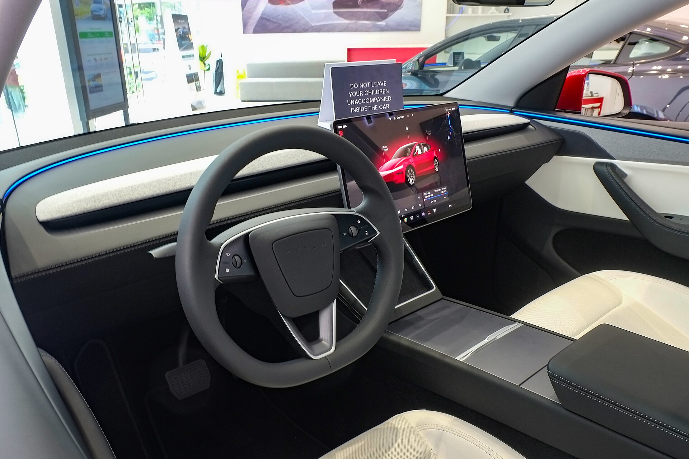

טסלה מודל Y ג'וניפר היא הגרסה המרועננת של הקרוסאובר החשמלי הנמכר ביותר בעולם, והיא כבר בדרך אל כבישי ישראל. מדובר ברענון עמוק — לא בדור חדש לגמרי — אך השינויים מורגשים היטב: עיצוב חדש בחזית ובאחורי, שקט נהיגה משופר משמעותית, איכות מושבים גבוהה יותר וטווח נהיגה מוגדל. אם התלבטתם בין החשמליות המשפחתיות בשוק, מודל Y המחודשת חוזרת להיות שחקנית מרכזית.

## מה חדש בטסלה מודל Y ג'וניפר?

השם "ג'וניפר" (Juniper) הוא כינוי הפיתוח הפנימי לרענון, בדומה ל"היילנד" של מודל 3. השינוי הבולט ביותר הוא בחזית: פס תאורה רציף לרוחב המכסה, פנסים דקים וחדים ומראה נקי יותר. גם באחורי יש פס תאורה חדשני, והצללית הכללית קיבלה ליטוש אווירודינמי שמסייע ליעילות ולטווח.

מעבר לעיצוב, טסלה השקיעה בעיקר בשני תחומים שהיו נקודות תורפה בדגם הקודם: **שקט הנהיגה** ו**נוחות המתלים**. זכוכית אקוסטית כפולה, בידוד רעשים משופר וכיוונון מתלים מחודש הופכים את הנסיעה לרגועה ושקטה בהרבה, במיוחד במהירויות כביש מהיר.

## הפנים: מסך, איכות ומרחב

תא הנוסעים ממשיך את הקו המינימליסטי של טסלה, אך עם שדרוגים מורגשים. המסך המרכזי בגודל 15.4 אינץ' שולט כמעט בכל פונקציה, ונוסף מסך אחורי קטן לנוסעים במושב השני — לשליטה במיזוג ובמולטימדיה. החומרים איכותיים יותר, תאורת אווירה עוטפת את הדלתות, והמושבים הקדמיים מאווררים.

המרחב הפנימי נותר מהיתרונות הגדולים של מודל Y: תא מטען אחורי גדול, תא מטען קדמי ("פרנק") נוסף, ומושב אחורי מתקפל חשמלית. מדובר ברכב פרקטי במיוחד למשפחה ישראלית ממוצעת.

### נהיגה וטווח

מערכת ההנעה החשמלית מספקת תאוצה חדה ומיידית, כמצופה מטסלה. גרסאות הבסיס עם הנעה אחורית מציעות תאוצה נאה, בעוד גרסת ההנעה הכפולה (Long Range AWD) מגיעה ל-0-100 קמ"ש בסביבות 4-5 שניות. הטווח בתקן WLTP עלה בגרסאות מסוימות לכ-600 ק"מ, שיפור שנובע מיעילות אווירודינמית ומניהול אנרגיה חכם יותר.

היכולת לטעון ברשת מטענים מהירים ולהגיע מ-10% ל-80% בכ-20-30 דקות (בתנאים אופטימליים) נותרה יתרון משמעותי, במיוחד לנוסעים ארוכי טווח.

## טסלה מודל Y ג'וניפר מול המתחרות

השוק החשמלי בישראל צפוף מתמיד, ומודל Y מתמודדת מול שחקניות חזקות. הנה השוואה כללית:

| דגם | טווח (WLTP, מוערך) | תא מטען | בולט ב... |
|------|------|------|------|
| טסלה מודל Y ג'וניפר | ~500-600 ק"מ | גדול + פרנק | רשת טעינה, ביצועים |
| סקודה אניאק | ~530 ק"מ | גדול מאוד | פרקטיות ונוחות |
| יונדאי איוניק 5 | ~480-570 ק"מ | בינוני | טעינה מהירה 800V |
| קיה EV6 | ~500-560 ק"מ | בינוני | עיצוב וספורטיביות |

כל אחת מהמתחרות מציעה יתרון משלה, אך טסלה ממשיכה להוביל בזכות תוכנה מתקדמת, עדכונים אלחוטיים ורשת הטעינה המהירה הרחבה שלה.

## כמה זה יעלה בישראל?

המחירים בישראל תלויים בגרסה ובעיקר במיסוי. חשוב לזכור ש**מס הקנייה על רכבים חשמליים עולה בהדרגה החל מ-2026**, מה שצפוי לייקר את המחיר הסופי לצרכן בהשוואה לשנים קודמות. עדיין, מודל Y ג'וניפר צפויה להיות ממוקמת בטווח המחירים של קרוסאוברים חשמליים משפחתיים בגזרת הביניים-פרימיום. מומלץ לבדוק את המחירון העדכני מול היבואן הרשמי לפני החלטה.

## למי מתאימה מודל Y ג'וניפר?

הרכב מתאים במיוחד למשפחות שמחפשות חשמלית מרווחת עם טווח ארוך, גישה נוחה לטעינה מהירה ורצון בטכנולוגיה מתקדמת. מי שמעדיף כפתורים פיזיים ומינימום מסכים אולי יתקשה להסתגל לפילוסופיה המינימליסטית של טסלה — אך הרוב יגלו רכב חשמלי בשל, נעים ופרקטי.
