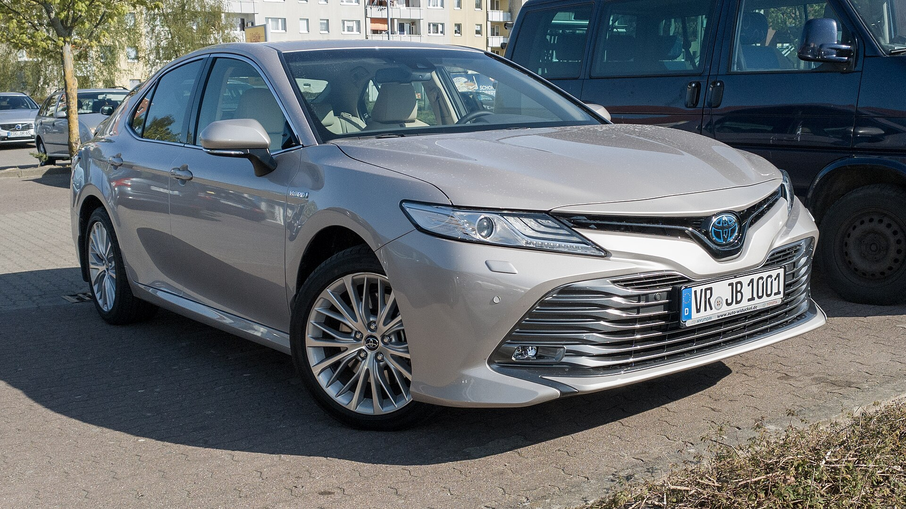

## האם טויוטה קאמרי היברید עדיין שווה קנייה?

**טויוטה קאמרי היברید** היא אחת התשובות המשכנעות ביותר לשאלה מדוע סדאן משפחתי עדיין רלוונטי בשוק שנשלט על ידי קרוסאוברים. מדובר בסדאן מרווח, שקט וחסכן במיוחד, שמצליח לספק חוויית נהיגה רגועה לצד צריכת דלק שמזכירה מכונית קטנה בהרבה. אם אתם מחפשים רכב משפחתי אמין לשנים רבות, זו עדיין בחירה שקשה להתעלם ממנה.

הדור הנוכחי מתבסס כולו על מערכת הנעה היברידית, ללא גרסת בנזין טהורה. השילוב בין מנוע בנזין בנפח 2.5 ליטר למנוע חשמלי מספק תאוצה חלקה ותחושת שקט מרשימה בעיר.

## איך נוהגת הקאמרי בכביש הישראלי?

בנהיגה יומיומית קאמרי מרגישה רגועה ובוגרת. ההיגוי מדויק אך אינו ספורטיבי, המתלים סופגים היטב מהמורות וספי מהירות, והבידוד האקוסטי מהמעולים בקטגוריה. מערכת ההיברид עוברת בין הנעה חשמלית לבנזין בצורה כמעט בלתי מורגשת, ובנסיעה עירונית איטית הרכב נע פרקי זמן ארוכים על חשמל בלבד.

בכביש מהיר הקאמרי יציבה ושלווה. התאוצה מ-0 ל-100 קמ"ש מתבצעת בסביבות 8 שניות — מספיק לעקיפות בטוחות, גם אם תיבת ה-CVT יוצרת תחושת "נהמה" מסוימת בלחיצה חזקה על הדוושה.

### כמה דלק היא באמת צורכת?

כאן קאמרי זורחת. בנהיגה מעורבת קל להגיע לצריכה ממוצעת של **4.5 עד 5 ליטר ל-100 ק"מ**, ובנהיגה עירונית זהירה אף פחות מכך. עבור נהג שעושה קילומטראז' גבוה, החיסכון בדלק לאורך שנים משמעותי מאוד.

## פנים הרכב: מרחב ונוחות

תא הנוסעים הוא אחד היתרונות הגדולים של קאמרי. המושב האחורי מציע מקום נדיב לרגליים ולראש, גם למבוגרים גבוהים, ותא המטען גדול ונוח לשימוש משפחתי או לנסיעות ארוכות. איכות החומרים סולידית, המסך המרכזי ברור, והתפעול אינטואיטיבי בלי עומס תפריטים מיותר.

מערכות הבטיחות של טויוטה, הכוללות בקרת שיוט אדפטיבית, שמירת נתיב וזיהוי הולכי רגל, מגיעות כחלק מהחבילה ומעניקות תחושת ביטחון בנהיגה יומיומית.

## טבלת השוואה: קאמרי היברید מול מתחרות

| פרמטר | טויוטה קאמרי היברید | היונדאי סונטה היברید | סקודה סופרב |
|---|---|---|---|
| סוג הנעה | היברید בלבד | היברید | בנזין/דיזל |
| צריכת דלק משולבת (ל/100) | כ-4.5-5 | כ-5-5.5 | כ-6-7 |
| נפח תא מטען | גדול | גדול | גדול מאוד |
| אופי נהיגה | רגוע ושקט | מאוזן | נוח ומרווח |
| אמינות צפויה | גבוהה מאוד | גבוהה | טובה |

## למי מתאימה טויוטה קאמרי היברید?

הקאמרי מתאימה במיוחד למי שמחפש **סדאן משפחתי חסכן, שקט ואמין**, ושם דגש על נוחות ועלויות אחזקה נמוכות יותר מאשר על אופי ספורטיבי. היא בחירה מצוינת לנהגים שעושים קילומטראז' גבוה, למשפחות, ולמי שמעדיף את תחושת הישיבה הנמוכה של סדאן על פני קרוסאובר גבוה.

מנגד, מי שמחפש עמדת נהיגה גבוהה, יכולת שטח קלה או עיצוב נועז יותר — כנראה יפנה לכיוון הקרוסאוברים המתחרים.

## שורה תחתונה

טויוטה קאמרי היברید ממשיכה להוכיח שסדאן משפחתי איכותי לא נעלם מהעולם. היא לא הרכב המרגש ביותר בכביש, אבל היא בין השלמים והחסכניים בקטגוריה — ובזכות שם המותג של טויוטה, ערך המכירה החוזרת שלה צפוי להישאר גבוה.
