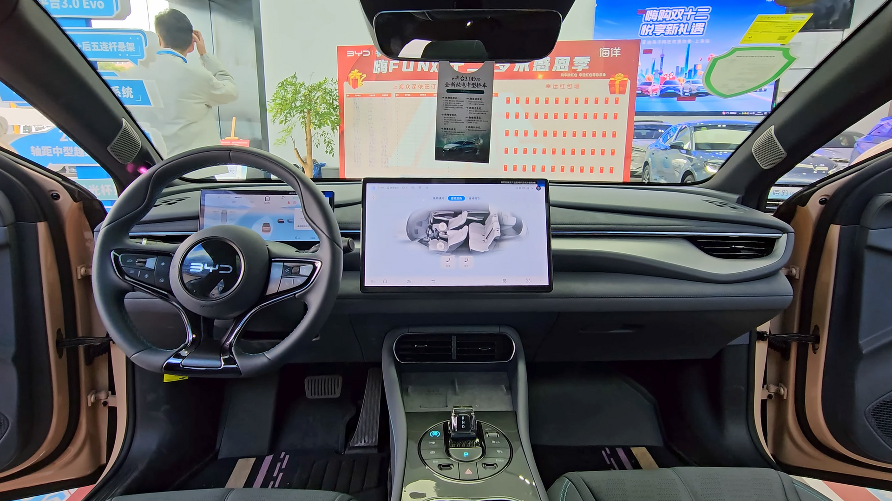

## מה זה BYD Seal ולמה הוא מעניין?

ה-BYD Seal הוא סדאן חשמלי משפחתי מבית היצרנית הסינית הגדולה BYD, שהפכה בשנים האחרונות לאחת מיצרניות הרכב החשמלי הגדולות בעולם. בישראל, שבה שוק הרכב החשמלי צומח במהירות, ה-Seal מוצב כמתחרה ישיר לטסלה מודל 3 — עם עיצוב מלוטש, ביצועים חדים ותא נוסעים עתיר טכנולוגיה. במבחן הדרך שלנו גילינו סדאן בוגר ומגובש, שמצליח להפתיע לטובה גם נהגים סקפטיים כלפי המותגים הסיניים.

הדגם בנוי על פלטפיזמת ה-e-Platform 3.0 הייעודית של BYD, המשלבת את סוללת ה"בלייד" (Blade) הידועה שלה. מדובר בסוללת ליתיום-ברזל-פוספט (LFP) שנחשבת בטוחה במיוחד מבחינה תרמית ובעלת אורך חיים גבוה.

## עיצוב חיצוני: אלגנטי וארודינמי

העיצוב של ה-Seal מבוסס על שפת ה"Ocean Aesthetics" של BYD, עם קווים זורמים, פנסים דקים וגג משופע בסגנון קופה. מקדם הגרר הנמוך (כ-0.22) תורם ליעילות אנרגטית ולטווח נהיגה נדיב. הפרופיל הצדדי נקי, ידיות הדלתות שוקעות אל תוך המרכב, והחלק האחורי מקבל תאורה רציפה בסגנון עדכני.

מדובר ברכב שנראה יקר יותר ממה שהוא באמת — נוכחות כביש מרשימה שמושכת מבטים.

## תא הנוסעים: פרימיום בגובה העיניים

הכניסה אל תא הנוסעים חושפת סביבה מודרנית ואיכותית. במרכז לוח המחוונים ניצב מסך מגע מסתובב בגודל כ-15.6 אינץ', לצד צג נהג דיגיטלי. איכות החומרים גבוהה, עם ריפודים רכים ותפירות דקורטיביות שמעניקות תחושה יוקרתית.

המרחב מלפנים ומאחור נדיב, ותא המטען מספק נפח סביר למשפחה. מערכת המולטימדיה עשירה, אם כי לוקח זמן להתרגל לכך שרוב הפקדים מרוכזים במסך.

## איך זה מרגיש על הכביש?

כאן ה-Seal באמת מפתיע. גרסת ההנעה הכפולה (AWD) מספקת האצה של כ-3.8 שניות מ-0 ל-100 קמש — נתון של רכב ספורט. גם גרסת ההנעה האחורית היחידה מציעה ביצועים ערניים ומספקים לחלוטין לשימוש יומיומי.

ההגה מדויק, המתלים מכוילים לאיזון טוב בין נוחות לבין יציבות בפניות, ומרכז הכובד הנמוך (הודות למיקום הסוללה ברצפה) מעניק תחושת נהיגה מגובשת. בכבישים המהירים ה-Seal שקט ויציב, ובנסיעה עירונית הוא זריז וקל לתמרון.

## טווח וטעינה

הטווח הרשמי בגרסאות בעלות הטווח הארוך נע בסביבות 550–570 קילומטרים במחזור WLTP, כאשר בפועל ניתן לצפות לטווח מעשי מעט נמוך יותר, בהתאם לסגנון הנהיגה ולתנאי מזג האוויר. ה-Seal תומך בטעינה מהירה בזרם ישר בהספק גבוה, המאפשר טעינה משמעותית בזמן קצר בעמדות ציבוריות.

## טבלת השוואה: BYD Seal מול טסלה מודל 3

| פרמטר | BYD Seal | טסלה מודל 3 |
|---|---|---|
| סוג | סדאן חשמלי | סדאן חשמלי |
| טכנולוגיית סוללה | בלייד LFP | ליתיום-יון / LFP |
| טווח (הערכה) | כ-550–570 קמ | כ-510–620 קמ |
| האצה 0–100 (גרסת ספורט) | כ-3.8 שניות | כ-3.3–4.4 שניות |
| מסך מרכזי | כ-15.6 אינץ' מסתובב | כ-15 אינץ' |
| רשת שירות בישראל | מתרחבת | מבוססת |

## למי ה-Seal מתאים?

ה-BYD Seal מתאים למי שמחפש סדאן חשמלי משפחתי עם עיצוב מרשים, ביצועים גבוהים ורמת ציוד עשירה — מבלי לשלם מחיר פרימיום מלא. הוא בחירה הגיונית במיוחד עבור נהגים שמעריכים נוחות נסיעה ותא נוסעים מפנק.

מנגד, מי שנרתע ממותג סיני חדש יחסית או שמעדיף רשת שירות ותיקה ובשלה, עשוי לרצות להשוות היטב מול המתחרים לפני החלטה.

## סיכום

ה-BYD Seal הוא הוכחה נוספת לכך שהיצרניות הסיניות סגרו את הפער — ואף עוקפות מתחרים ותיקים בכמה פרמטרים. עם ביצועים חדים, טווח נדיב, תא נוסעים איכותי ומחיר תחרותי, הוא מציב אתגר אמיתי בזירת הסדאנים החשמליים בישראל.
