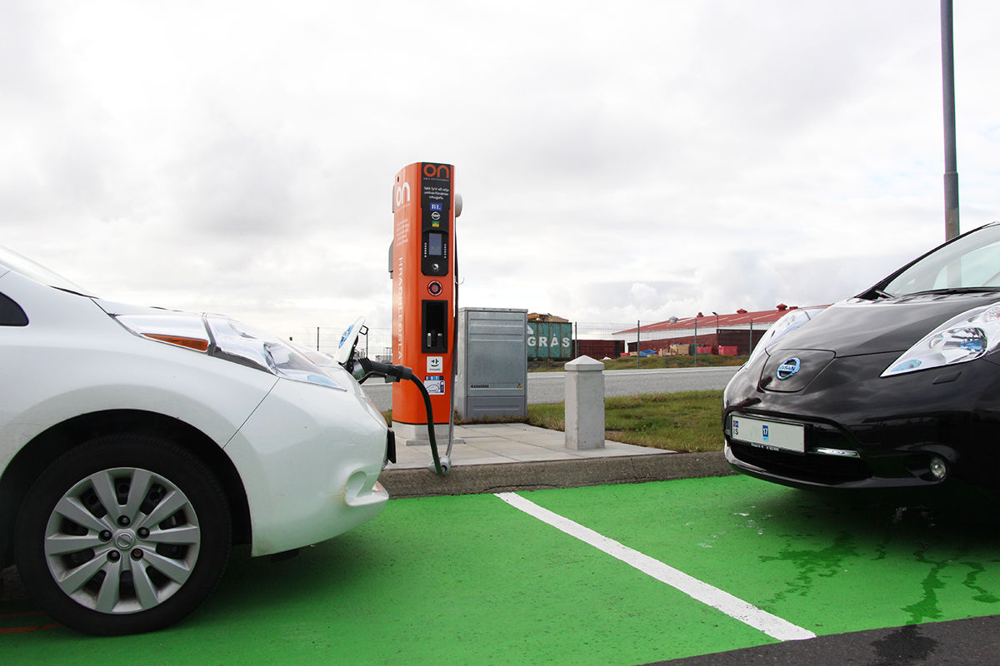

## מה מייחד את BYD סיל בשוק החשמלי הישראלי?

**BYD סיל** היא סדאן חשמלית ספורטיבית שנכנסת לזירה התחרותית ביותר בשוק החשמלי בישראל — קטגוריית הסדאנים המשפחתיים-ספורטיביים שבה שולטת כבר שנים טסלה מודל 3. סיל מציעה עיצוב זורם, טווח נדיב, ביצועים חדים ומפרט עשיר, והיא מציבה סימן שאלה אמיתי מול המתחרה האמריקאית. מדובר באחת ההשקות החשמליות המדוברות של השנה, ובצדק.

היצרנית הסינית BYD כבר ביססה נוכחות משמעותית בישראל עם דגמים כמו אטו 3 ודולפין, אך סיל היא הניסיון הרציני שלה לתקוף את הפלח הפרימיום-משפחתי. הרכב בנוי על פלטפורמה חשמלית ייעודית עם מתח מערכת גבוה, מה שמשפר את יעילות הטעינה ואת הביצועים.

## עיצוב ותא נוסעים

מבחוץ, BYD סיל מציגה קווים אווירודינמיים בהשראת עולם הים — כולל פנסים חדים, גג משופע וידיות דלת שקועות. מקדם הגרר הנמוך תורם ישירות לטווח וליעילות. הרכב נראה בוגר ויקר יותר ממה שהמחיר מרמז.

בפנים מקבלים תא נוסעים מודרני עם מסך מגע מרכזי מסתובב בגודל נדיב, לוח מחוונים דיגיטלי נפרד ושפע חומרים רכים. איכות ההרכבה גבוהה, והמרווח למרות קו הגג המשופע נותר סביר גם למבוגרים במושב האחורי. תא המטען מציע נפח מכובד, ובחלק מהגרסאות קיים גם תא אחסון קדמי קטן.

### נוחות וטכנולוגיה

מערכת המולטימדיה עשירה ותומכת בעדכוני תוכנה אלחוטיים. מערך הבטיחות כולל בקרת שיוט אדפטיבית, שמירת נתיב, זיהוי הולכי רגל ומצלמות היקפיות. חלק מהפונקציות מנוהלות דרך המסך, מה שדורש התרגלות — אך זהו סטנדרט מקובל בעולם החשמלי כיום.

## טווח, סוללה וטעינה

הלב של BYD סיל הוא סוללת ה**להב** (Blade) מבית BYD, המבוססת על כימיית ליתיום-ברזל-פוספט. הטכנולוגיה הזו ידועה ביציבות התרמית הגבוהה, בעמידות לאורך שנים ובבטיחות מוגברת מפני התלקחות.

הטווח הריאלי בגרסאות ארוכות הטווח נע בסביבות **450 עד 520 קילומטר** בנהיגה מעורבת, בהתאם לתנאי הכביש, מזג האוויר וסגנון הנהיגה. בטעינה מהירה בזרם ישר ניתן להוסיף טווח משמעותי בפרק זמן קצר יחסית, אם כי קצב הטעינה השיא נמוך מעט מזה של חלק מהמתחרים.

## ביצועים ונהיגה

כאן BYD סיל מפתיעה לטובה. גרסת ההנעה הכפולה (ארבע גלגלים) מאיצה מ-0 ל-100 קמ"ש בכ-**4 שניות**, נתון שמעמיד אותה בטריטוריה של רכבי ספורט. גם גרסת ההנעה האחורית היחידה מספקת האצה מיידית ותחושת נהיגה נעימה.

המתלים מכוונים לאיזון בין נוחות לספורטיביות, ומרכז הכובד הנמוך (בזכות מיקום הסוללה ברצפה) מעניק יציבות טובה בפניות. ההגה מדויק אך לא עתיר תחושה, וזהו פשרה מקובלת ברכבים חשמליים מהסוג הזה.

## BYD סיל מול טסלה מודל 3 — טבלת השוואה

| פרמטר | BYD סיל | טסלה מודל 3 |
|---|---|---|
| סוג סוללה | להב (ליתיום-ברזל-פוספט) | ליתיום (משתנה לפי גרסה) |
| טווח ריאלי משוער | 450-520 ק"מ | 450-560 ק"מ |
| האצה 0-100 (גרסה גבוהה) | כ-4 שניות | כ-4.4 שניות |
| תא אחסון קדמי | קטן | קיים |
| רשת טעינה ייעודית | לא | סופר-צ'רג'רים |
| מיצוב מחיר | תחרותי | תחרותי |

## למי מתאימה BYD סיל?

BYD סיל מתאימה למי שמחפש סדאן חשמלית עם אופי ספורטיבי, מפרט עשיר וטווח נדיב, מבלי לשלם מחיר פרימיום מלא. היא מהווה חלופה אמיתית לטסלה מודל 3 עבור נהגים שמעדיפים חוויית נהיגה נוחה ומגוון פונקציות פיזיות ודיגיטליות כאחד.

החיסרון המרכזי מול טסלה הוא היעדר רשת טעינה ייעודית, מה שמחייב הסתמכות על רשתות הטעינה הציבוריות בישראל. מנגד, סוללת הלהב מספקת יתרון משמעותי בבטיחות ובשמירה על הקיבולת לאורך זמן.

בשורה התחתונה, BYD סיל היא אחת ההוכחות הבולטות לכך שהיצרניות הסיניות כבר לא מתחרות רק על מחיר, אלא גם על איכות, ביצועים וטכנולוגיה — ובישראל זה כבר מורגש היטב.
