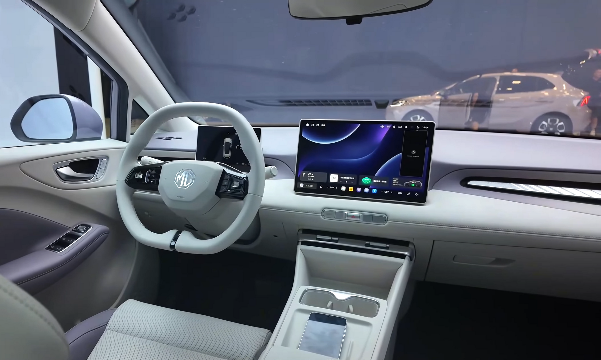

ה-**MG4 החשמלית** הפכה באחת מהחשמליות הסיניות המדוברות בישראל, והסיבה ברורה: היא מציעה חבילה של ביצועים, טווח ומרחב פנימי במחיר שקשה להתעלם ממנו. במבחן הדרך שלנו גילינו קומפקטית זריזה ומאוזנת שמצליחה להתחרות בכבוד מול שמות מבוססים כמו פולקסווגן ID.3 וקיה נירו — ולעיתים אף לעקוף אותם בפרמטר המחיר.

המכונית בנויה על פלטפורמה חשמלית ייעודית (הנקראת Modular Scalable Platform), מה שמאפשר רצפה שטוחה, מרכז כובד נמוך והנעה אחורית — שילוב לא שגרתי בקטגוריה הזו. התוצאה היא רכב שמרגיש יציב ומהוקצע יותר ממה שהמחיר מרמז.

## איך ה-MG4 מרגישה על הכביש?

הדבר הראשון שמורגש הוא הזריזות. גרסת הבסיס מפיקה כוח מספק לחיי היומיום, בעוד הגרסאות החזקות יותר מספקות תאוצה נמרצת שמדביקה רכבים יקרים בהרבה. ההנעה האחורית מעניקה תחושת נהיגה מאוזנת, וההגה מדויק וקליל דיו לתמרון בעיר.

המתלים מכוילים לצד הנוקשה-נעים — הם בולעים היטב את רוב מפגעי הדרך הישראליים, אך מהמורות חדות מורגשות בתא הנוסעים. במהירויות כביש בין-עירוני ה-MG4 שקטה יחסית, עם בידוד רעשי רוח וגלגלים סביר לרמת המחיר.

### טווח וטעינה

הטווח הריאלי נע בין כ-**350 קילומטרים** בגרסת הסוללה הקטנה ועד כ-**450 קילומטרים** בגרסאות עם הסוללה הגדולה, בהתאם לתנאי הנהיגה, המזג והשימוש במיזוג. בנהיגה עירונית מתונה קל להגיע לנתונים הרשמיים, ובכביש מהיר הצריכה עולה כצפוי בכל רכב חשמלי.

הטעינה המהירה תומכת בהספקים המאפשרים מעבר מ-10 ל-80 אחוז בכ-35-40 דקות בעמדה מתאימה — נתון תחרותי בקטגוריה.

## תא הנוסעים והמולטימדיה

בפנים מקבלים עיצוב נקי ומינימליסטי, עם מסך מולטימדיה מרכזי וצג דיגיטלי קטן לנהג. המרחב לנוסעים האחוריים נדיב ביחס למידות החיצוניות, ותא המטען מציע נפח סביר לצרכים משפחתיים יומיומיים.

עם זאת, לא הכול מושלם. חלק מהפונקציות, כולל כוונון המזגן, מוטמעות בתוך המסך ודורשות התרגלות — לא תמיד נוח לתפעל אותן בנהיגה. איכות החומרים סבירה, אך ניכר שבוצעו כמה פשרות כדי לשמור על המחיר האטרקטיבי.

## MG4 מול המתחרות — טבלת השוואה

| פרמטר | MG4 | פולקסווגן ID.3 | קיה נירו EV |
|---|---|---|---|
| מבנה | האצ'בק חשמלי | האצ'בק חשמלי | קרוסאובר חשמלי |
| הנעה | אחורית | אחורית | קדמית |
| טווח משוער | 350-450 ק"מ | 400-550 ק"מ | עד ~450 ק"מ |
| מיצוב מחיר | תחרותי מאוד | בינוני-גבוה | בינוני-גבוה |
| דירוג בטיחות | גבוה | גבוה | גבוה |

## בטיחות

ה-MG4 מגיעה עם חבילת מערכות סיוע נהיגה רחבה הכוללת בקרת שיוט אדפטיבית, שמירת נתיב, זיהוי הולכי רגל ובלימת חירום אוטומטית. הדגם זכה לדירוג גבוה במבחני יורו NCAP, מה שמחזק את מעמדה כאופציה בטוחה למשפחה.

חשוב לציין שחלק ממערכות הסיוע מתערבות באופן מורגש, ויש נהגים שיעדיפו לכייל או לכבות חלק מהן — פעולה שאפשרית דרך התפריטים.

## למי ה-MG4 מתאימה?

ה-MG4 מתאימה במיוחד למי שמחפש **רכב חשמלי** ראשון או שני במשפחה, עם תקציב מחושב אך בלי לוותר על חוויית נהיגה ראויה. היא אידיאלית לנסיעות עירוניות ובין-עירוניות יומיומיות, ופחות מיועדת לנוסעי מרחקים ארוכים ותכופים שיעדיפו טווח גדול יותר.

מי שמגיע מרקע של מותגים אירופיים מבוססים ידרוש התרגלות קצרה למאפייני הגימור והמולטימדיה, אך בתמורה יקבל ערך כספי גבוה במיוחד.

## סיכום

ה-**MG4 החשמלית** היא הוכחה נוספת לכך שהיצרנים הסינים למדו לייצר רכבים חשמליים בשלים ומשכנעים. היא לא מושלמת — הגימור חסכוני והמולטימדיה דורשת סבלנות — אך כחבילה כוללת היא מציעה אחת מהתמורות הטובות בשוק החשמליות הקומפקטיות בישראל. אם המחיר הוא שיקול מרכזי, קשה להתעלם ממנה.
