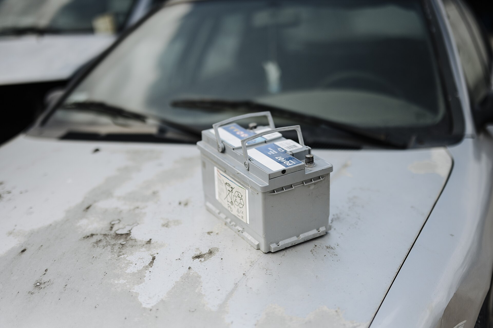

אחד התסכולים הגדולים של נהגים בישראל הוא לגלות בבוקר קר או חם שהרכב פשוט לא מתניע. ברוב המקרים האשם הוא **מצבר רכב** שהגיע לסוף חייו או נחלש בלי שהבחנתם. הבשורה הטובה: כמעט תמיד יש סימני אזהרה מוקדמים, ואפשר להיערך מראש כדי להימנע מהתקיעה המעצבנת.

במדריך הזה נסביר איך מזהים **מצבר רכב** חלש, כמה שנים הוא אמור להחזיק, ומה אפשר לעשות כדי להאריך את חייו — במיוחד בתנאי מזג האוויר הקיצוניים של ישראל.

## למה מצבר הרכב מתרוקן דווקא בבוקר?

מצבר מאבד חלק מכוחו כשהוא קר או כשהוא חלש, ובבוקר שתי התופעות נפגשות: הרכב עמד שעות רבות, החום שנצבר במנוע התפוגג, וההתנעה דורשת את זרם הפריצה הגבוה ביותר. מצבר בריא מתמודד עם זה בקלות, אבל מצבר שחוק כבר לא מצליח לספק את הזרם הדרוש.

גורם נוסף הוא **צריכת זרם סמויה** — מערכות מולטימדיה, אזעקה, ומחשבים שממשיכים לצרוך מעט חשמל גם כשהרכב כבוי. אם המצבר כבר חלש, הצריכה הזו מספיקה כדי לרוקן אותו לגמרי במהלך הלילה.

## מהם סימני האזהרה של מצבר חלש?

לפני שמצבר נכנע לחלוטין, הוא כמעט תמיד שולח אותות. שימו לב לתסמינים הבאים:

- **התנעה איטית או מתקשה** — הסטרטר מסתובב לאט לפני שהמנוע נדלק.
- **אורות עמומים** — פנסים או תאורת לוח מחוונים שנחלשים, במיוחד בסרק.
- **תקלות חשמל אקראיות** — חלונות חשמליים איטיים, מערכת שמע שמתאפסת.
- **נורית מצבר בלוח המחוונים** — סימן שדורש בדיקה מיידית.
- **ריח של גופרית או ביצים** — עלול להעיד על מצבר שדולף או מתחמם יתר על המידה.

אם זיהיתם אחד או יותר מהסימנים האלה, כדאי לגשת לבדיקה במוסך לפני שתישארו תקועים.

## כמה שנים מחזיק מצבר רכב בישראל?

באופן כללי, מצבר רכב מחזיק בין **3 ל-5 שנים**. אולם בישראל תוחלת החיים נוטה להיות קצרה יותר — לעיתים 3 עד 4 שנים בלבד. הסיבה המרכזית מפתיעה רבים: דווקא **החום** ולא הקור הוא האויב הגדול של המצבר.

החום הגבוה מאיץ את האידוי של הנוזלים בתוך המצבר ומזרז את שחיקת הרכיבים הפנימיים. הקור, לעומת זאת, פשוט חושף מצבר שכבר נחלש. לכן מצברים רבים בישראל נכנעים בסופו של דבר בחורף — אבל הנזק האמיתי נגרם להם בקיץ הקודם.

## מה משפיע על אורך חיי המצבר?

| גורם | השפעה על המצבר |
|------|----------------|
| חום קיצוני (קיץ ישראלי) | שוחק מהר, מקצר תוחלת חיים |
| נסיעות קצרות ותכופות | טעינה חלקית בלבד, שחיקה מוקדמת |
| נסיעות ארוכות סדירות | טעינה מלאה, שמירה על בריאות המצבר |
| השבתה ממושכת של הרכב | פריקה עצמית, סיכון להתרוקנות |
| צריכת אביזרים בסרק | עומס נוסף על המצבר |

הטבלה ממחישה נקודה חשובה: אם אתם נוהגים בעיקר נסיעות קצרות בעיר — לעבודה ובחזרה, כמה קילומטרים בכל פעם — המצבר כמעט לא מספיק להיטען במלואו. עם הזמן זה שוחק אותו.

## איך מאריכים את חיי המצבר?

יש כמה הרגלים פשוטים שיכולים להוסיף חודשים ואף שנים לחיי המצבר:

1. **צאו מדי פעם לנסיעה ארוכה** — כדי לאפשר טעינה מלאה, במיוחד אם אתם נוהגים בעיקר בעיר.
2. **כבו צרכני חשמל לפני כיבוי הרכב** — מזגן, מערכת שמע ותאורה.
3. **הימנעו מהשארת הרכב ללא שימוש לתקופות ארוכות** — אם הרכב עומד שבועות, שקלו מטען תחזוקה.
4. **שמרו על ניקיון הקטבים** — קורוזיה על החיבורים פוגעת במעבר הזרם.
5. **בצעו בדיקת מצבר תקופתית** — רוב המוסכים ומרכזי השירות מבצעים בדיקה מהירה בחינם או בעלות סמלית.

## מתי חובה להחליף את המצבר?

אם המצבר עבר את גיל 4, מראה סימני חולשה חוזרים, או נכשל בבדיקת עומס במוסך — אל תהמרו. עדיף להחליף אותו באופן יזום מאשר להישאר תקועים בחניון או בצד הדרך. בעת ההחלפה חשוב להתאים מצבר עם **זרם פריצה (CCA) וקיבולת (אמפר-שעה)** תואמים להמלצת היצרן — מצבר חלש מדי לא יספיק, ומצבר לא מתאים עלול לגרום לתקלות.

השקעה קטנה בתחזוקה ובבדיקה תקופתית חוסכת הרבה עוגמת נפש. מצבר הרכב הוא רכיב שקט שרובנו זוכרים בו רק כשהוא מפסיק לעבוד — אבל קצת תשומת לב מראש שומרת אתכם על הכביש.
