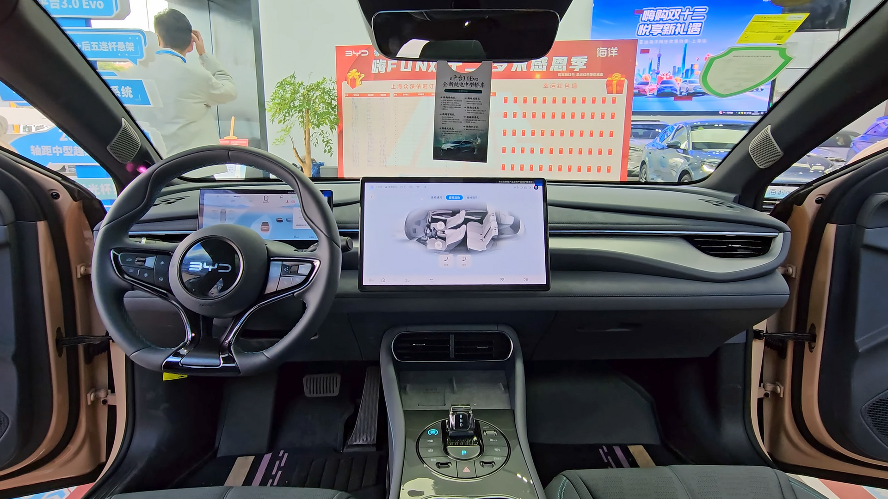

## BYD Seal — האם הסינית הספורטיבית מצליחה?

**BYD Seal** היא סדאן חשמלית שמכוונת גבוה: היא רוצה להתמודד ראש בראש מול טסלה מודל 3, ובמבחן הדרך שלנו בישראל היא הוכיחה שיש לה נשק אמיתי. מדובר ברכב עם עיצוב זורם, ביצועים חדים, פנים מפנקים וטווח נסיעה נדיב — כל זאת בתמחור שמציב אותה כאחת החלופות המעניינות ביותר בקטגוריית הסדאנים החשמליים.

ביד (BYD), אחת מיצרניות הרכב החשמלי הגדולות בעולם, ביססה נוכחות משמעותית בישראל, וה-Seal היא דגם הדגל הספורטיבי שלה. היא בנויה על פלטפורמה ייעודית לרכב חשמלי, עם סוללה מסוג Blade המשולבת במבנה המרכב לחיזוק הקשיחות.

## עיצוב חיצוני שמושך מבטים

העיצוב של ה-Seal נאמן לשפה שביד מכנה "Ocean Aesthetics", עם קווים זורמים בהשראת הים. החזית נמוכה ואגרסיבית, פנסי הלד דקים והגג משתפל אל אחורי הרכב בסגנון קופה. מקדם הגרר הנמוך תורם גם לטווח וגם לתחושה ספורטיבית. ידיות הדלתות השקועות נפתחות אוטומטית בהתקרבות — פרט קטן שמשדר יוקרה.

## איך זה מרגיש מבפנים?

תא הנוסעים של **BYD Seal** הוא אחד היתרונות הגדולים שלה. חומרי הגימור רכים ואיכותיים, ריפודי העור נעימים, והתחושה הכללית קרובה יותר לפרימיום מאשר למחיר שבו הרכב נמכר. במרכז בולט מסך מגע גדול שיכול להסתובב אוטומטית בין תצוגה לרוחב לתצוגה לאורך, לצד מסך דיגיטלי מלא מול הנהג.

מערכת המולטימדיה מגיבה יפה, אך התפריטים לעיתים עמוסים ודורשים התרגלות. המרחב לנוסעים האחוריים נדיב, ותא המטען מציע נפח סביר לצד תא אחסון קדמי קטן. הציוד עשיר וכולל גג זכוכית פנורמי, מערכת שמע איכותית ומגוון רחב של מערכות בטיחות אקטיביות.

## ביצועים וטווח — כאן היא מפתיעה

בגרסת ההנעה הכפולה (ארבע גלגלים) ה-Seal מספקת האצה חדה שקוטעת את המרחק ל-100 קמ"ש בפחות מ-4 שניות — נתון שמעמיד אותה בשורה אחת עם רכבי ספורט. גם גרסת ההנעה האחורית הבסיסית יותר מספקת תחושת נהיגה מהנה ותגובתית.

המתלים מכוילים לאיזון בין נוחות לספורטיביות, וההיגוי מדויק. תחושת הנהיגה יציבה וחדה יחסית, אם כי חובבי הנהיגה הטהורה עשויים לחפש מעט יותר משוב מכיוון ההגה.

מבחינת טווח, הנתונים המוצהרים נעים בטווח של כ-500 עד 570 קילומטר בהתאם לגרסה ולגודל הסוללה. בשימוש יומיומי מעורב בישראל סביר לצפות לטווח מעשי נמוך מעט מהמוצהר, כמקובל ברכבים חשמליים. תמיכת הטעינה המהירה מאפשרת מילוי משמעותי של הסוללה בזמן קצר יחסית בעמדות טעינה מהירות.

## BYD Seal מול טסלה מודל 3 — השוואה

המתחרה הטבעית של ה-Seal היא **טסלה מודל 3**. שתיהן סדאנים חשמליים ספורטיביים עם דגש על ביצועים וטכנולוגיה, אך לכל אחת אופי משלה.

| פרמטר | BYD Seal | טסלה מודל 3 |
|---|---|---|
| קטגוריה | סדאן חשמלית ספורטיבית | סדאן חשמלית ספורטיבית |
| האצה 0-100 (גרסה עליונה) | פחות מ-4 שניות | פחות מ-4 שניות |
| טווח מוצהר | כ-500-570 ק"מ | כ-510-630 ק"מ |
| איכות פנים | חומרים רכים ומפנקים | מינימליסטי ונקי |
| מסך מרכזי | מסך מסתובב + צג נהג | מסך מרכזי בלבד |
| רשת טעינה | ציבורית | סופרצ'רג'ר + ציבורית |

היתרון הבולט של ה-Seal הוא איכות הפנים והציוד העשיר, בעוד שטסלה שומרת על יתרון ברשת הטעינה הייעודית ובממשק התוכנה.

## למי מתאימה BYD Seal?

היא מתאימה למי שמחפש סדאן חשמלית עם אופי ספורטיבי, פנים מפנקים וטווח נדיב, מבלי לשלם מחירי פרימיום מלאים. משפחות שמעדיפות סדאן על פני קרוסאובר, ונהגים שמחפשים תחושת נהיגה חדה, ימצאו בה חבילה אטרקטיבית במיוחד.

מנגד, מי שמבסס את הנסיעות הבין-עירוניות הארוכות שלו על נוחות טעינה מרבית עדיין ייהנה מיתרונות רשת הטעינה של המתחרות הוותיקות.

## שורה תחתונה

**BYD Seal** היא הצהרת כוונות: ביד לא מסתפקת ברכבים חשמליים זולים, אלא מציגה מוצר בשל, מהיר ואיכותי שמאתגר את השחקנים המובילים. עבור השוק הישראלי, שמאמץ רכבים חשמליים בקצב מהיר, מדובר בתוספת מרעננת ומשכנעת.
