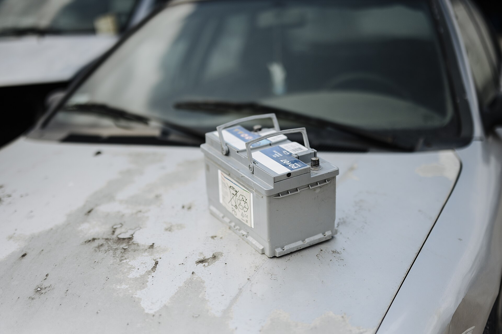

מצבר הרכב הוא אחד הרכיבים שאנחנו נזכרים בקיומם רק כשהם מתקלקלים — בדרך כלל בבוקר לחוץ, כשהרכב מסרב להתניע. בישראל, שבה הקיץ ארוך והחום קיצוני, מצבר הרכב עובד קשה במיוחד, ואורך חייו לרוב קצר מהמצופה. במדריך הזה נסביר איך לזהות שהמצבר מתקרב לסוף דרכו, מה מקצר את חייו, ואיך אפשר להאריך אותם.

## מהם הסימנים שמצבר הרכב עומד להיגמר?

הסימן הראשון והברור ביותר הוא **התנעה איטית**. אם המנוע "מתאמץ" ומסתובב לאט לפני שהוא נדלק, זהו רמז חזק שהמצבר מתקשה לספק זרם. סימנים נוספים כוללים:

- **עמעום אורות** — הפנסים הקדמיים או תאורת הפנים נחלשים, במיוחד בסרק או בהתנעה.
- **נורית אזהרה** בצורת מצבר בלוח המחוונים.
- **מערכות חשמל שמתנהגות מוזר** — חלונות חשמליים איטיים, מסך מולטימדיה שנכבה ונדלק.
- **ריח של גופרית** (ביצים סרוחות) מאזור תא המנוע — סימן לדליפה או לכשל פנימי.
- **התנעה מתקשה בעיקר בבוקר** אחרי שהרכב עמד לילה שלם.

אם אתם מזהים אחד או יותר מהסימנים האלה, כדאי לגשת לבדיקה לפני שתמצאו את עצמכם תקועים.

## למה דווקא בישראל המצבר נגמר מהר?

רבים חושבים שקור הוא האויב הגדול של המצבר, אבל האמת הפוכה: **החום הוא המזיק העיקרי**. טמפרטורות גבוהות מאיצות את התאדות הנוזל האלקטרוליטי ואת התהליכים הכימיים בתוך המצבר, מה שגורם לבלאי מהיר של הלוחות הפנימיים. בקיץ הישראלי, כשהחום בתא המנוע חוצה בקלות את ה-60 מעלות, המצבר משלם את המחיר.

גורם נוסף הוא **דפוס הנסיעה**. הרבה נהגים ישראלים נוסעים נסיעות קצרות ותכופות בתוך העיר — כמה קילומטרים בכל פעם. נסיעות כאלה אינן מספיקות כדי לטעון את המצבר במלואו אחרי ההתנעה, וכך הוא נמצא כרונית במצב טעינה חלקית שמקצר את חייו.

## כמה זמן מחזיק מצבר רכב?

מצבר רכב ממוצע מחזיק **בין שלוש לחמש שנים**. באקלים חם, ובשילוב עם נסיעות קצרות, לא נדיר לראות מצברים שנחלשים כבר אחרי שנתיים וחצי עד שלוש שנים. ברכבים היברידים וחשמליים יש בנוסף למצבר ההנעה גם מצבר 12 וולט קטן, שאף הוא נשחק ודורש החלפה תקופתית.

### טבלת השוואה: סוגי מצברים נפוצים

| סוג מצבר | יתרונות | חסרונות | מתאים ל |
|---|---|---|---|
| חומצה-עופרת רגיל | זול, זמין בכל מקום | אורך חיים בינוני, דורש תחזוקה | רכבים ותיקים ופשוטים |
| מצבר לא מתוחזק (סגור) | ללא תחזוקת נוזלים | מחיר מעט גבוה יותר | רוב הרכבים המודרניים |
| מצבר AGM | עמיד, מתאים למערכת סטארט-סטופ | יקר יותר | רכבים חדשים עם המערכת |

## איך מאריכים את חיי המצבר?

יש כמה הרגלים פשוטים שיכולים להוסיף למצבר חודשים ואף שנים:

1. **שלבו נסיעות ארוכות** מדי פעם כדי לאפשר טעינה מלאה.
2. **כבו צרכני חשמל** (אורות, מיזוג, מערכת שמע) לפני ההתנעה.
3. **החנו בצל** ככל האפשר כדי להפחית את חשיפת המצבר לחום.
4. **ודאו שהחיבורים נקיים** — קורוזיה על הקטבים פוגעת במעבר הזרם.
5. **אם הרכב עומד ימים רבים** ללא שימוש, שקלו מטען תחזוקה ("טפטפת").

## מה עושים כשהמצבר כבר גמר?

אם הרכב לא מתניע, אפשר לבצע **התנעת שרשרת** (כבלים מרכב אחר) כפתרון זמני. חשוב לחבר נכון: אדום לחיובי בשני הרכבים, שחור לשלילי במקור ולנקודת מסה מתכתית ברכב התקוע. עם זאת, זהו פתרון חירום בלבד — מצבר שהתרוקן לגמרי או התיישן צריך החלפה.

החלפת מצבר ברכבים מודרניים רבים דורשת גם **קידוד ורישום** של המצבר החדש במחשב הרכב, במיוחד בדגמים עם מערכת סטארט-סטופ. לכן ברכבים חדשים עדיף לבצע את ההחלפה במוסך מוסמך ולא לבד.

שורה תחתונה: אל תמתינו לתקיעה. אם המצבר בן יותר משלוש שנים והרכב מתחיל להתניע באיטיות — בקשו בדיקת מצבר פשוטה בביקור השירות הקרוב. זו בדיקה של דקות שיכולה לחסוך לכם בוקר מתסכל.
