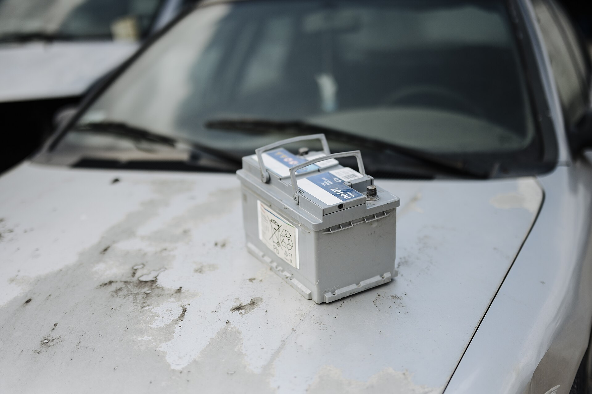

מתי צריך להחליף **מצבר לרכב**? התשובה הקצרה: כשמופיעים סימני אזהרה כמו התנעה איטית, נורות עמומות או תקלות חשמל אקראיות — או פשוט כשעברו 3 עד 5 שנים מהתקנתו. בישראל, שבה הקיץ הארוך והחם שוחק את המצבר מהר יותר מהממוצע העולמי, כדאי להכיר את הסימנים מוקדם ולא לחכות לרגע שבו הרכב פשוט לא מתניע בבוקר.

המצבר הוא רכיב שקט שרובנו שוכחים מקיומו — עד שהוא נכשל. במאמר הזה נעבור על שבעת סימני האזהרה המרכזיים, על הסיבות לכשל מוקדם, ועל מה שאפשר לעשות כדי להאריך את חיי המצבר.

## שבעה סימנים שהמצבר עומד למות

1. **התנעה איטית או כבדה** — כשאתם מסובבים את המפתח (או לוחצים על כפתור ההתנעה) והמנוע "מתאמץ" ומסתובב לאט לפני שהוא מתעורר, זהו הסימן הקלאסי ביותר למצבר מתרוקן.
2. **נורות עמומות** — פנסים קדמיים או תאורה פנימית שנחלשים כשהמנוע כבוי, או מתעמעמים כשמפעילים צרכני חשמל נוספים.
3. **תקלות חשמל אקראיות** — מערכת המולטימדיה שנכבית, חלונות חשמליים איטיים, או הודעות שגיאה שמופיעות ונעלמות.
4. **נורת אזהרה בלוח המחוונים** — סמל המצבר האדום או נורת בדיקת מנוע שנדלקים עשויים להצביע על בעיית טעינה.
5. **מארז מצבר נפוח** — חום קיצוני עלול לגרום לדפנות המצבר להתנפח, וזהו סימן ודאי להחלפה מיידית.
6. **ריח של גופרית או ביצים רקובות** — עשוי להעיד על נזילת חומצה או מצבר שהתחמם יתר על המידה.
7. **גיל המצבר** — אם עברו יותר מארבע שנים, הסבירות לכשל עולה מדרמטית גם ללא סימנים מקדימים.

## למה מצברים מתים מהר בישראל?

הגורם מספר אחת הוא **החום**. בניגוד לתפיסה הרווחת, דווקא הקיץ הישראלי הוא זה ששוחק את המצבר בשקט — הטמפרטורה הגבוהה מאיצה את התאדות הנוזלים ואת שחיקת הלוחות הפנימיים. הכשל עצמו מתרחש לרוב בבוקר החורפי הראשון, כשהקור חושף מצבר שכבר נחלש בקיץ.

גורם משמעותי נוסף הוא **נסיעות קצרות ותכופות**. אם אתם נוסעים בעיקר מרחקים של כמה קילומטרים, האלטרנטור אינו מספיק להטעין את המצבר במלואו, והוא נשאר במצב טעינה חלקי כרוני שמקצר את חייו.

גם **צרכני חשמל שנשארים דלוקים** — תאורה, מטענים, מצלמת דרך שמוזנת ברציפות — מנקזים את המצבר כשהרכב חונה.

## סוגי מצברים: מה מתאים לרכב שלכם?

לא כל מצבר מתאים לכל רכב. רכבים מודרניים עם מערכת **סטארט-סטופ** דורשים מצברים מסוג מיוחד שיכולים לעמוד במחזורי טעינה-פריקה תכופים. התקנת מצבר רגיל ברכב כזה תגרום לכשל מהיר.

| סוג מצבר | מתאים ל... | עמידות | טווח מחיר יחסי |
|---|---|---|---|
| רגיל (נוזלי) | רכבים ללא סטארט-סטופ | סטנדרטית | נמוך |
| EFB | סטארט-סטופ בסיסי | טובה | בינוני |
| AGM | סטארט-סטופ מתקדם, רכבי יוקרה | גבוהה מאוד | גבוה |

**חשוב:** תמיד החליפו למצבר בעל מפרט זהה או תואם לזה שהגיע מהיצרן. שדרוג או הורדה של סוג המצבר עלול לפגוע במערכות הרכב.

## איך מאריכים את חיי המצבר?

- **צאו לנסיעות ארוכות מדי פעם** כדי לאפשר טעינה מלאה של המצבר.
- **כבו את כל צרכני החשמל** לפני כיבוי הרכב, ובדקו שלא נשארה תאורה דולקת.
- **שמרו על ניקיון הקטבים** — שכבת חלודה או קורוזיה לבנה על הקטבים פוגעת במגע החשמלי.
- **בדקו את המצבר לפני החורף** — בדיקת עומס פשוטה במוסך אורכת כמה דקות ותחסוך לכם בוקר תקוע.
- **אם הרכב עומד זמן רב**, שקלו מטען תחזוקה (trickle charger) ששומר על מתח תקין.

## כמה עולה להחליף מצבר?

המחיר משתנה בהתאם לסוג המצבר ולדגם הרכב. מצבר רגיל נע בדרך כלל בטווח הזול יחסית, בעוד מצברי AGM לרכבי סטארט-סטופ ורכבי יוקרה יקרים משמעותית. לרוב מומלץ להחליף מצבר בשירות מקצועי — הן בגלל התאמת המפרט והן בגלל הצורך באיפוס מערכות ברכבים חדשים לאחר ההחלפה.

השורה התחתונה: אל תחכו לרגע שבו הרכב לא מתניע. אם המצבר בן יותר מארבע שנים או שהופיע אחד מהסימנים שציינו — כדאי לבדוק אותו עוד היום.
