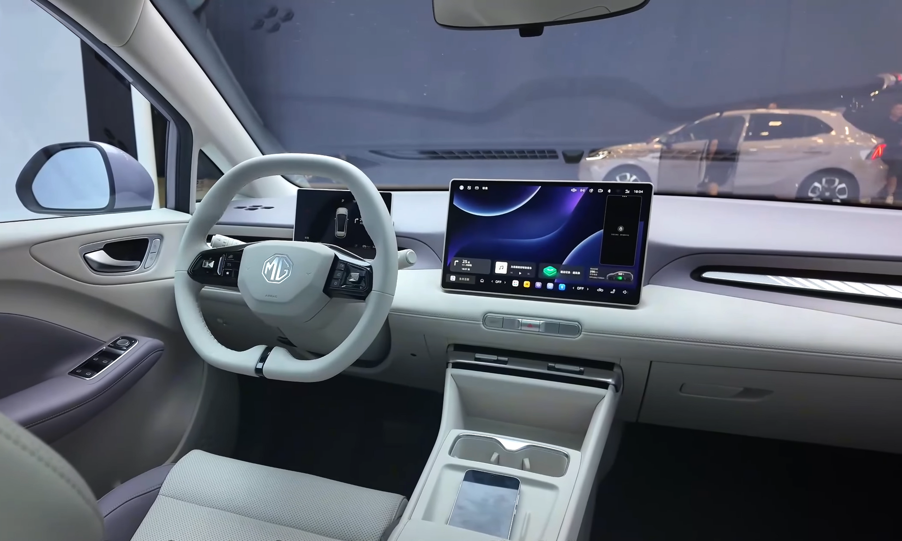

## מבחן דרך MG4: מה מייחד את החשמלית הסינית?

ה-**MG4** הפכה לאחת החשמליות המדוברות בשוק הישראלי, וההסבר פשוט: היא מציעה שילוב נדיר של הנעה אחורית, עיצוב ספורטיבי ומחיר שמתחרה בגבורה ברכבים יקרים בהרבה. במבחן דרך MG4 שערכנו בכבישי הארץ גילינו מכונית קומפקטית שמצליחה להרגיש בוגרת ומהנה לנהיגה הרבה מעל מה שהתג המחיר מרמז.

מדובר במשפחת רכב חשמלי קטן-בינוני (סגמנט C), שמתחרה ישירות בדגמים כמו פולקסווגן ID.3, קיה EV3 והחשמליות הסיניות האחרות שממלאות את השוק. היתרון הבולט של ה-MG4 הוא שהיא נבנתה מלכתחילה כפלטפורמה חשמלית ייעודית, מה שמאפשר מרכז כובד נמוך ופיזור משקל מאוזן.

## עיצוב וחוץ: ספורטיבי בלי להתאמץ

ה-MG4 מציגה קווים חדים, גג משופע וספוילר אחורי כפול שמעניק לה נוכחות דינמית. הפנסים הקדמיים דקים והחזית נמוכה, מה שיוצר מראה צעיר ותוסס. במידות היא ארוכה כ-4.28 מטר, כך שהיא נוחה לחנייה בעיר אך עדיין מרווחת מספיק לארבעה נוסעים בנוחות.

## תא נוסעים ומולטימדיה

בפנים מקבלים עיצוב מינימליסטי עם שני מסכים: לוח מחוונים דיגיטלי קטן מול הנהג ומסך מגע מרכזי לניהול כל המערכות. **מערכת המולטימדיה** תומכת בחיבור אלחוטי לסמארטפון, אך יש לציין שחלק מהפקדים — כולל כוונון המזגן — מרוכזים במסך ודורשים התרגלות. איכות החומרים סבירה לקטגוריה, עם שילוב של משטחים קשיחים ורכים.

תא המטען מציע נפח של כ-350 ליטר, שמתרחב משמעותית בקיפול המושבים האחוריים — מספיק לצרכים משפחתיים יומיומיים.

## טווח וביצועים: כמה רחוק תגיעו?

זהו הלב של כל רכב חשמלי. ה-MG4 מגיעה במספר גרסאות סוללה, עם **טווח מוצהר** שנע בין כ-350 קילומטר בגרסת הבסיס ועד סביב 450 קילומטר בגרסאות עם הסוללה הגדולה יותר. בשימוש מעורב אמיתי בישראל, כולל נהיגה עירונית ובין-עירונית, סביר לצפות לטווח מעשי נמוך במעט מהמספרים הרשמיים — כמקובל בכל החשמליות.

ההנעה האחורית מעניקה תחושת נהיגה נעימה ומאוזנת, וההאצה מיידית ומספקת בהחלט לשימוש יומיומי. במבחן הדרך התרשמנו במיוחד מהתנהגות הרכב בסיבובים: מרכז הכובד הנמוך מקטין את הנטייה להתנדנד ומעניק ביטחון.

## טבלת השוואה: MG4 מול מתחרות בקטגוריה

| פרמטר | MG4 | קיה EV3 | פולקסווגן ID.3 |
|---|---|---|---|
| סוג הנעה | אחורית | קדמית | אחורית |
| טווח מוצהר (טווח) | ~350–450 ק"מ | ~430–600 ק"מ | ~420–550 ק"מ |
| אורך | ~4.28 מ' | ~4.30 מ' | ~4.26 מ' |
| רמת מחיר | תחרותית מאוד | בינונית | גבוהה יותר |
| נפח תא מטען | ~350 ליטר | ~460 ליטר | ~385 ליטר |

*הנתונים הם הערכות כלליות ומשתנים לפי גרסה ושנת ייצור.

## בטיחות

ה-MG4 מגיעה עם חבילה עשירה של מערכות בטיחות אקטיביות, הכוללת בלימת חירום אוטומטית, ניטור נתיב, בקרת שיוט אדפטיבית וזיהוי הולכי רגל. בבדיקות הבטיחות האירופיות היא זכתה לדירוג גבוה, מה שמחזק את מעמדה כאופציה בטוחה למשפחה.

## למי ה-MG4 מתאימה?

- **לזוגות ומשפחות קטנות** שמחפשים רכב חשמלי ראשון במחיר נגיש.
- **לחובבי נהיגה** שמעריכים הנעה אחורית ותחושת כביש ספורטיבית.
- **לנהגים עירוניים** שזקוקים לרכב קומפקטי וזריז, אך עם טווח סביר גם לנסיעות ארוכות מדי פעם.

## סיכום מבחן דרך MG4

ה-MG4 מוכיחה שרכב חשמלי איכותי ומהנה לא חייב לעלות הון. היא לא מושלמת — הארגונומיה של הפקדים דרך המסך ואיכות חלק מהחומרים משאירות מקום לשיפור — אך מכלול היתרונות שלה, ובראשם היחס המצוין בין מחיר לתמורה וחוויית הנהיגה, הופך אותה לאחת ההצעות המשתלמות ביותר בשוק החשמלי הישראלי כיום.
