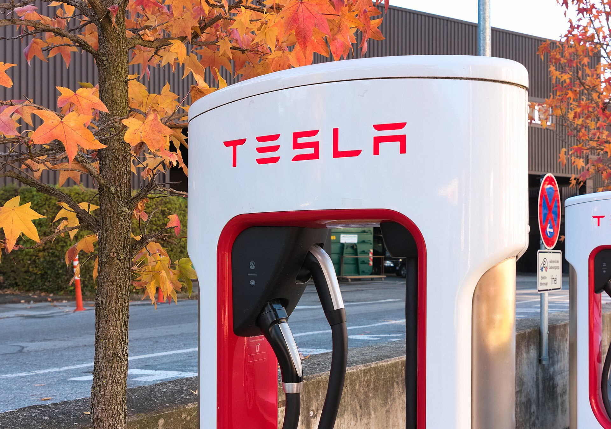

טסלה מודל Y ג'וניפר היא העדכון המשמעותי ביותר שקיבל הקרוסאובר החשמלי הנמכר בעולם מאז השקתו, והיא מגיעה לישראל עם עיצוב מרוענן, שיפורים בנוחות ובשקט הנסיעה, ומערכת מולטימדיה משודרגת. התשובה הקצרה: זו עדיין אחת החשמליות המשתלמות והמלוטשות בשוק, אך המתחרים התקרבו מאוד.

## מה חדש בטסלה מודל Y ג'וניפר?

העדכון, שזכה לכינוי הפנימי "ג'וניפר", מביא רצועת תאורה רציפה בחזית ובאחור, פגושים מעוצבים מחדש ושיפורים אווירודינמיים שמפחיתים את מקדם הגרר. הרכב מעט ארוך יותר, אך הפרופיל הכללי נשאר מוכר.

השינויים המשמעותיים באמת מסתתרים בפנים. טסלה השקיעה רבות בבידוד אקוסטי: זכוכית כפולה, אטמים משופרים וריפוד נוסף הופכים את תא הנוסעים לשקט משמעותית במהירויות גבוהות — נקודת חולשה היסטורית של הדגם.

### תא הנוסעים והטכנולוגיה

במרכז לוח המחוונים ניצב מסך גדול אופקי, ולראשונה נוספה לנוסעים האחוריים תצוגה קטנה משלהם לבקרת מיזוג ובידור. חומרי הגמר שודרגו, התאורה הסביבתית מקיפה את כל התא, והמושבים מאווררים בגרסאות המובילות. מערכת המולטימדיה נותרת מהמהירות והחלקות בשוק, עם עדכוני תוכנה אלחוטיים תכופים.

עם זאת, טסלה ממשיכה בגישה המינימליסטית — אין לוח מחוונים מול הנהג, וכמעט כל פעולה מתבצעת דרך המסך המרכזי. יש שיאהבו את הניקיון העיצובי, ואחרים יתגעגעו לכפתורים פיזיים.

## איך היא נוסעת?

בכביש מודל Y ג'וניפר מרגישה בוגרת יותר מקודמתה. מערכת המתלים כוילה מחדש לנוחות טובה יותר, והיא בולעת מהמורות ופסי האטה בצורה מעודנת יותר מבעבר. ההיגוי מדויק, והתאוצה — גם בגרסה הבסיסית — מיידית וחלקה כמצופה מרכב חשמלי.

השקט המשופר משנה את חוויית הנסיעה הבינעירונית לחלוטין. נסיעות ארוכות פחות מעייפות, ורעשי הרוח והכביש מבודדים היטב.

## טווח, טעינה ותשתית בישראל

הטווח המוצהר בגרסאות המובילות נע בטווח שבין כ-500 ל-600 ק"מ במחזור הבדיקה האירופי (WLTP), כאשר בשימוש אמיתי בישראל, בשילוב מזג אוויר חם ונהיגה בינעירונית, סביר לצפות לפחות מכך.

היתרון הבולט של טסלה נותר **רשת העל-מטענים** הפרוסה ברחבי ישראל, שמאפשרת טעינה מהירה ואמינה בזמן שהמתחרים עדיין מסתמכים על רשתות ציבוריות מגוונות. הרכב תומך בטעינה מהירה בזרם ישר שמאפשרת להוסיף מאות קילומטרים בכ-20–30 דקות בתנאים אופטימליים.

## טבלת השוואה: מודל Y ג'וניפר מול המתחרים

| פרמטר | טסלה מודל Y ג'וניפר | קיה EV6 | BYD Sealion 7 |
|---|---|---|---|
| קטגוריה | קרוסאובר חשמלי | קרוסאובר חשמלי | קרוסאובר חשמלי |
| טווח מוצהר (משוער) | 500–600 ק"מ | 480–530 ק"מ | 450–500 ק"מ |
| רשת טעינה ייעודית | על-מטענים נרחבת | ציבורית | ציבורית |
| מולטימדיה | מהירה, מעודכנת אלחוטית | מסך כפול | מסך מסתובב |
| חלל אחסון קדמי | כן, נדיב | קטן | קטן |

## למי מתאימה טסלה מודל Y ג'וניפר?

הרכב מתאים למשפחות שמחפשות קרוסאובר חשמלי מרווח, עם תא מטען גדול, חלל אחסון קדמי נדיב ותשתית טעינה נוחה. היא אידיאלית למי שנוסע רבות בין ערים ומעריך את יתרון רשת העל-מטענים.

מנגד, מי שמחפש חוויית נהיגה עם כפתורים פיזיים מסורתיים ולוח מחוונים קלאסי — עשוי להעדיף מתחרים אירופאים או קוריאנים. גם המתחרים הסיניים, שמציעים אבזור עשיר במחיר תחרותי, מהווים שיקול משמעותי.

## סיכום

טסלה מודל Y ג'וניפר לוקחת דגם מנצח ומשפרת בדיוק את הנקודות שהיו זקוקות לתשומת לב: שקט, נוחות ואיכות גמר. היא נותרת בחירה חכמה בקטגוריית הקרוסאוברים החשמליים, אך התחרות בישראל מעולם לא הייתה צפופה יותר. מומלץ לבחון גם את המתחרים לפני החתימה.
