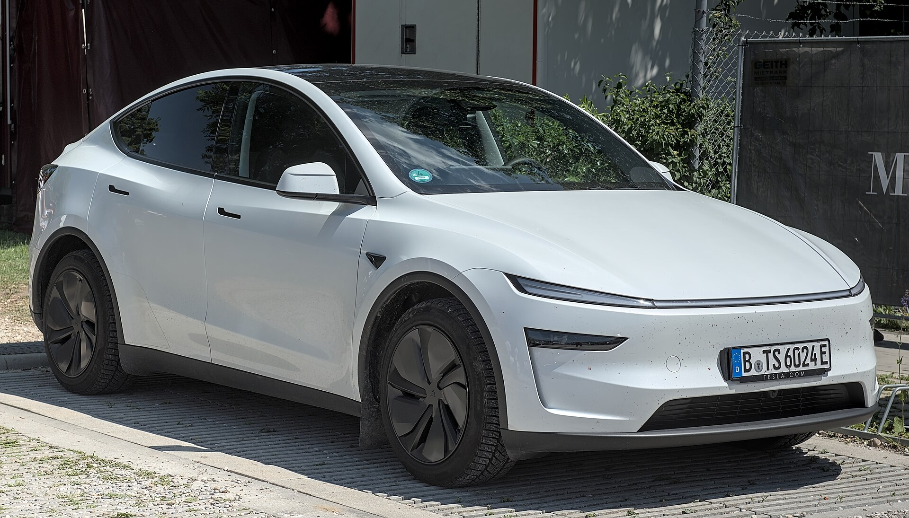
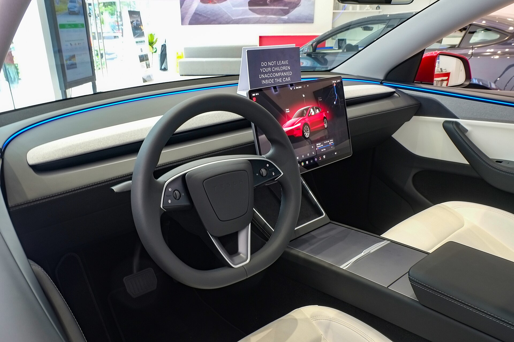

טסלה מודל Y החדשה, המכונה בשם הקוד "ג'וניפר", מגיעה לישראל ומביאה עמה עדכון מקיף לקרוסאובר החשמלי הנמכר ביותר בעולם. מדובר בעדכון אמצע-דור (facelift) ולא בדגם חדש מהיסוד, אך השינויים בעיצוב, בנוחות ובאיכות הנסיעה מורגשים היטב ומחזקים את מעמדו של הדגם מול תחרות חשמלית ההולכת וגוברת.

## מה חדש בטסלה מודל Y החדשה?

השינוי הבולט ביותר הוא בעיצוב החיצוני. **החזית עוצבה מחדש** עם רצועת תאורה מלאה לרוחב, בהשראת עיצוב הסדאן מודל 3 המעודכן, מה שמעניק לרכב מראה חד ומודרני יותר. גם החלק האחורי קיבל תאורה מרשימה שמשתלבת בזכוכית התא, ופגושים מעודכנים משדרגים את הנוכחות על הכביש.

מעבר לאסתטיקה, טסלה השקיעה מאמץ ניכר ב**איכות הנסיעה**. הרכב קיבל בידוד אקוסטי משופר, זכוכיות עבות יותר ומתלים מכוילים מחדש. התוצאה היא תא נוסעים שקט יותר וספיגת מהמורות נעימה יותר — נקודה שהייתה מוקד לביקורת בדור הקודם.

### הפנים: שקט, נקי ומעודכן

גם בתא הנוסעים ניכרים שיפורים. המסך המרכזי נותר לב המערכת, אך נוספה **תצוגה אחורית לנוסעים** ומגוון חומרי גימור משודרגים. טסלה שמרה על הקו המינימליסטי המזוהה איתה, אך שיפרה את תחושת האיכות של המשטחים והחומרים. תא המטען הגדול והמרווח נותר יתרון מובהק של הדגם למשפחות.

## טווח, ביצועים וטעינה

המערכת החשמלית עברה כיול מחדש שמשפר קלות את **הטווח הרשמי** לעומת הדור הקודם, בהתאם לגרסה ולגודל הסוללה. הגרסאות הצפויות להגיע לישראל כוללות דגם אחורי-הנעה (RWD) בעל הטווח הגדול, וגרסת הנעה כפולה (Long Range Dual Motor) לחובבי הביצועים.

במונחים מעשיים, מדובר ברכב שמסוגל לטווח נסיעה מוצהר של מאות קילומטרים בטעינה מלאה, ותומך בטעינה מהירה ברשת ה-Supercharger של טסלה הפרוסה בישראל, לצד עמדות ציבוריות אחרות.

## טסלה מודל Y החדשה מול התחרות בישראל

השוק הישראלי מוצף כיום בקרוסאוברים חשמליים משפחתיים, וטסלה מודל Y החדשה מתמודדת מול מגוון רחב של יריבים אירופיים, קוריאניים וסיניים. הנה השוואה כללית להתמצאות:

| דגם | קטגוריה | יתרון בולט |
|---|---|---|
| טסלה מודל Y החדשה | קרוסאובר חשמלי | רשת טעינה, תוכנה, טווח |
| סקודה אניאק | קרוסאובר חשמלי | פרקטיות ומרחב פנימי |
| קיה EV6 | קרוסאובר חשמלי | טעינה מהירה ועיצוב |
| יונדאי איוניק 5 | קרוסאובר חשמלי | נוחות ואיכות בנייה |

היתרון המשמעותי של טסלה נותר **המערכת האקולוגית** — רשת הטעינה הרחבה, עדכוני התוכנה האלחוטיים והממשק הנוח. מנגד, המתחרים מציעים לעיתים גימור פנים מוקפד יותר ומגוון פתרונות אחסון פרקטיים.

## למי מתאימה טסלה מודל Y החדשה?

הדגם מתאים במיוחד ל**משפחות** המחפשות רכב חשמלי מרווח, בעל טווח נסיעה נדיב וגישה לרשת טעינה נוחה. השיפורים בנוחות ובשקט הופכים אותו לאטרקטיבי יותר גם עבור מי שנסע בדור הקודם והרגיש שהמתלים נוקשים מדי.

למי שמחפש תג מחיר נמוך יותר, ייתכן שדגמים חשמליים קומפקטיים יתאימו יותר, אך בקטגוריית הקרוסאוברים המשפחתיים החשמליים — טסלה מודל Y החדשה נשארת שחקנית מובילה שקשה להתעלם ממנה.

**שורה תחתונה:** העדכון של ג'וניפר אינו מהפכני, אך הוא ממוקד ונכון — טסלה זיהתה את החולשות של הדור הקודם וטיפלה בהן בנקודות הנכונות.
