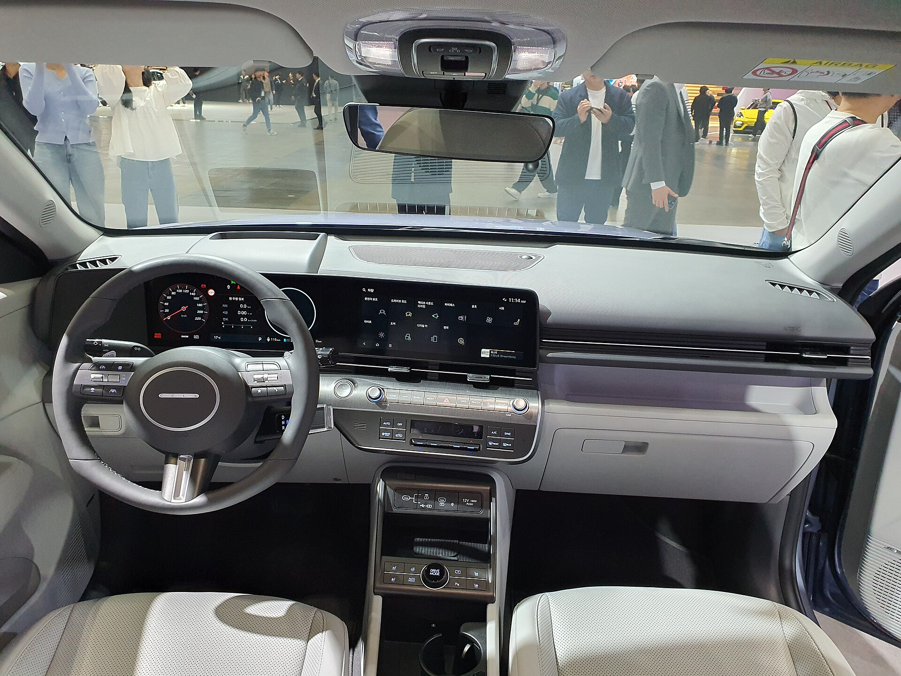

## מה חדש ביונדאי קונה חשמלי?

**יונדאי קונה חשמלי** בדורו השני הוא לא סתם עדכון קוסמטי — זהו רכב שתוכנן מהיסוד סביב הפלטפורמה החשמלית. התוצאה היא קרוסאובר קומפקטי שגדל בכל ממד, קיבל עיצוב עתידני יותר, והפך לאחת ההצעות המעניינות ביותר בשוק החשמלי הקומפקטי בישראל. מי שחיפש חשמלי משפחתי-קטן עם טווח אמיתי ומחיר שפוי — מקבל כאן מועמד רציני.

החזית מאופיינת בפס תאורה רציף לרוחב, קווים חדים וזוויתיים, וגובה מרשים מהקרקע שמעניק תחושת שטח. יונדאי בחרה בשפה עיצובית נועזת שמצליחה לבלוט בחניון בלי להיראות מוגזמת.

## כמה טווח הוא באמת נותן?

השאלה הראשונה של כל קונה ישראלי היא הטווח. **יונדאי קונה חשמלי** מגיע בישראל בעיקר בגרסה ארוכת-הטווח, עם סוללה בקיבולת של כ-65 קילוואט-שעה וטווח מוכרז של כ-450 עד 500 קילומטר במחזור הבדיקה האירופי. בנהיגה יומיומית מעורבת, ובעיקר בעיר, אפשר לצפות לטווח מציאותי של כ-380-420 קילומטר — נתון מצוין לקטגוריה.

הטעינה במטען מהיר מזרם ישיר מאפשרת מעבר מ-10% ל-80% תוך פחות מ-45 דקות בתנאים אופטימליים. בבית, עם עמדת טעינה בהספק 11 קילוואט, טעינה מלאה תתבצע במהלך הלילה בנוחות מוחלטת.

## איך זה מרגיש על הכביש?

הנהיגה של קונה חשמלי נעימה ורגועה. המנוע החשמלי מספק תאוצה חלקה ומיידית שמצוינת לעקיפות עירוניות ולכניסה לצומת. הגרסה החזקה מפתחת הספק של כ-215 כוחות סוס ומאיצה מ-0 ל-100 קמ"ש בכ-7.8 שניות — לא רכב ספורט, אבל בהחלט זריז ומספק.

מערכת בקרת ההאטה המחדשת (רגנרציה) ניתנת לכוונון בכמה רמות באמצעות ידיות ההילוכים שמאחורי ההגה, כולל מצב "נהיגה בדוושה אחת" שנוח מאוד בעומסי תנועה. המתלים מכוילים לנוחות, וסופגים היטב את בורות הכביש הישראלי, אם כי בכניסה מהירה לפניות מורגש מעט גלגול גוף.

## פנים הרכב: מרווח וטכנולוגי

כאן קונה עשה קפיצת מדרגה משמעותית. **תא הנוסעים** התרחב, ומרווח הרגליים מאחור נעים גם למבוגרים. תא המטען גדל לכ-460 ליטר — נתון תחרותי מאוד שמאפשר נסיעות משפחתיות ללא דאגות.

לוח המחוונים מבוסס על שני מסכים של 12.3 אינץ' — אחד למכשירים ואחד למולטימדיה — עם ממשק ברור, מהיר ואינטואיטיבי. יונדאי השאירה בחוכמה כפתורים פיזיים לבקרת האקלים, מה שמקל מאוד בזמן נהיגה. איכות החומרים סבירה לקטגוריה, עם שילוב של משטחים רכים ופלסטיקים קשיחים יותר בחלקים הנמוכים.

## טבלת השוואה: יונדאי קונה חשמלי מול המתחרים

| פרמטר | יונדאי קונה חשמלי | קיה EV3 | וולוו EX30 |
|---|---|---|---|
| טווח מוכרז (ק"מ) | כ-450-500 | כ-430-560 | כ-340-480 |
| הספק (כ"ס) | כ-215 | כ-204 | כ-272 |
| נפח מטען (ליטר) | כ-460 | כ-460 | כ-320 |
| אופי | משפחתי מאוזן | פרקטי ומרווח | ספורטיבי-פרימיום |

## בטיחות ומערכות סיוע

קונה מגיע עם חבילת מערכות בטיחות עשירה: בלימת חירום אוטומטית עם זיהוי הולכי רגל ואופניים, שמירת נתיב אקטיבית, בקרת שיוט אדפטיבית, ניטור שטח מת והתראת תנועה חוצה בנסיעה לאחור. במבחני הבטיחות האירופיים הדגם קיבל דירוג גבוה, מה שמחזק את מעמדו כרכב משפחתי בטוח.

## למי זה מתאים ומה המחיר?

**יונדאי קונה חשמלי** מתאים למי שמחפש רכב חשמלי ראשון או שני למשפחה, עם טווח אמיתי, מרווח פנימי נדיב ותחזוקה נוחה. הוא מתחרה ישירות בגל הרכבים החשמליים הסיניים, אך מציע יתרון של מותג מבוסס עם רשת שירות רחבה בישראל ואמינות מוכחת.

התמחור צפוי לנוע בטווח שמציב אותו כהצעה תחרותית בקטגוריה — לא הזול ביותר, אך עם ערך כולל גבוה. בשילוב האחריות הארוכה של יונדאי, זו הצעה שקשה להתעלם ממנה.
