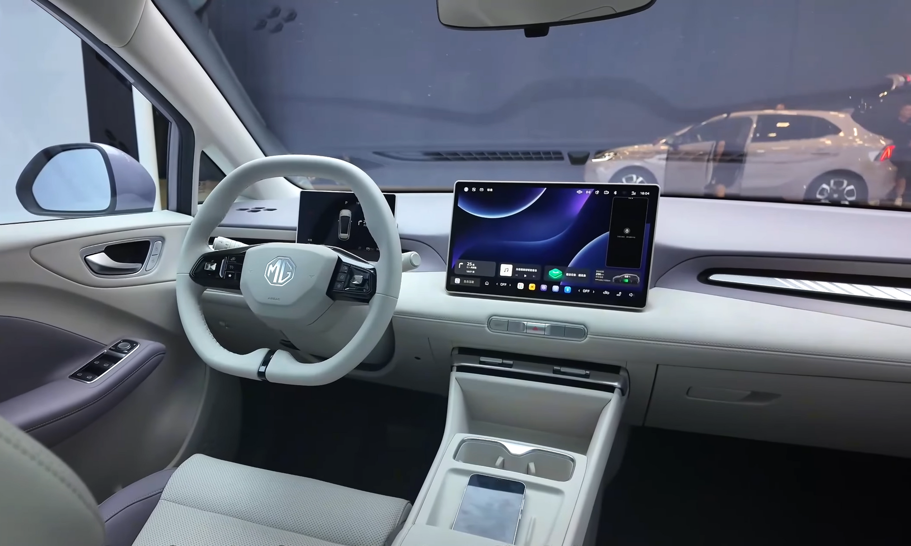

## מבחן דרך: ה-MG4 החשמלית שמשנה את חוקי המשחק

ה-MG4 החדשה הפכה לאחת החשמליות המדוברות בישראל, וב**מבחן דרך MG4** שערכנו רצינו לבדוק אם ההייפ מוצדק. התשובה הקצרה: מדובר בחשמלית משפחתית קומפקטית שמציעה חבילה מרשימה של טווח סביר, נהיגה מהנה ותמחור תחרותי שקשה להתעלם ממנו. אם.ג'י, המותג שהפך תחת בעלות סינית לאחד השחקנים הבולטים בשוק, מכוונת כאן ישירות אל הקונה הישראלי שמחפש כניסה לעולם החשמלי בלי לשבור את הכיס.

## עיצוב חיצוני: ספורטיבי ועכשווי

מבחינה עיצובית, ה-MG4 שוברת את התדמית השמרנית של המותג. הקווים החדים, הגג המשופע והספוילר האחורי הכפול מעניקים לה נוכחות ספורטיבית שמזכירה יותר האצ'בק חם מאשר חשמלית משפחתית. פנסי הלד הצרים והחישוקים בעיצוב אווירודינמי משלימים מראה צעיר ורענן. המידות הקומפקטיות — אורך של כ-4.3 מטרים — הופכות אותה לנוחה במיוחד לחניה ולנהיגה עירונית בערים הישראליות הצפופות.

## פנים הרכב: פשטות פונקציונלית

בתא הנוסעים מקבלת אותנו סביבה מינימליסטית ונקייה. במרכז לוח המחוונים ניצב מסך מולטימדיה בגודל של כ-10 אינץ', ולצדו צג דיגיטלי קטן לנהג. חומרי הגימור סבירים למחיר, אם כי לא יוקרתיים — יש כאן לא מעט משטחי פלסטיק קשיח. עם זאת, ההרכבה מוצקה והתחושה הכללית איכותית מהמצופה.

מערכת המולטימדיה תומכת בחיבור אלחוטי לטלפון, אך הממשק אינו מהמהירים בשוק ולעיתים דורש הסתגלות. מרחב הראש והרגליים מלפנים נדיב, ומאחור יש מקום סביר לשני מבוגרים בנוחות. תא המטען מציע נפח שימושי לצרכים יומיומיים ולקניות משפחתיות.

## טווח וסוללה: כמה באמת נוסעים?

זה הלב של כל **רכב חשמלי משפחתי**. ה-MG4 מוצעת במספר גרסאות סוללה, כאשר הטווח המוצהר נע בטווח שבין כ-350 קילומטרים בגרסאות הבסיסיות ועד כ-450 קילומטרים בגרסאות עם הסוללה הגדולה יותר. בשימוש ריאלי, בשילוב של נהיגה עירונית ובין-עירונית, ניתן לצפות לטווח מעט נמוך מהמוצהר — כמקובל בכל החשמליות.

הטעינה במטען מהיר בזרם ישר מאפשרת מילוי מ-10 ל-80 אחוז בפרק זמן של כחצי שעה בתנאים אופטימליים, מה שהופך את הרכב למתאים גם לנסיעות ארוכות מדי פעם.

## חוויית נהיגה: ההפתעה הגדולה

כאן ה-MG4 באמת מפתיעה לטובה. בניגוד לרוב המתחרות במחיר, היא בנויה על פלטפורמה עם **הנעה אחורית** ומרכז כובד נמוך הודות למיקום הסוללה בריצפה. התוצאה היא רכב מאוזן, זריז ומהנה בפניות, עם היגוי מדויק ותחושת דרך טובה. המתלים מכוילים לנוחות סבירה, גם אם על מהמורות חדות מורגשת מעט קשיחות.

התאוצה מיידית וחלקה, אופיינית לחשמליות, ומספקת דחיפה נעימה בזינוק מהרמזור. השקט בתא הנוסעים גבוה, אם כי במהירויות כביש בין-עירוני נכנסים רעשי רוח וגלגלים.

## טבלת השוואה: MG4 מול מתחרות בקטגוריה

| פרמטר | אם.ג'י MG4 | יונדאי קונה חשמלית | פולקסווגן ID.3 |
|---|---|---|---|
| סוג הנעה | אחורית | קדמית | אחורית |
| טווח מוצהר (משוער) | 350–450 ק"מ | 380–450 ק"מ | 420–550 ק"מ |
| אופי נהיגה | ספורטיבי | נוח | מאוזן |
| רמת מחיר | תחרותית מאוד | בינונית | גבוהה |
| גודל | קומפקטי | קומפקטי | קומפקטי-בינוני |

## מחיר ותמחור בישראל

היתרון המרכזי של ה-MG4 הוא התמחור. מחיריה נחשבים מהאטרקטיביים בקטגוריית החשמליות המשפחתיות בישראל, ולעיתים היא מציעה יותר טווח וציוד תמורת כל שקל בהשוואה למתחרות האירופיות והקוריאניות. חשוב לזכור שמדובר בהערכות, ומומלץ לבדוק את המחירון העדכני ואת מדיניות מס הקנייה המשתנה לפני רכישה.

## סיכום: למי מתאימה ה-MG4?

ה-MG4 היא בחירה נבונה למשפחות ולנהגים שמחפשים כניסה לעולם החשמלי במחיר שפוי, בלי לוותר על חוויית נהיגה מהנה. היא לא מושלמת — המולטימדיה יכולה להיות מהירה יותר וחומרי הגימור בסיסיים — אך החבילה הכוללת של טווח, ביצועים ותמחור הופכת אותה לאחת ההצעות המשתלמות בשוק הישראלי כיום.
