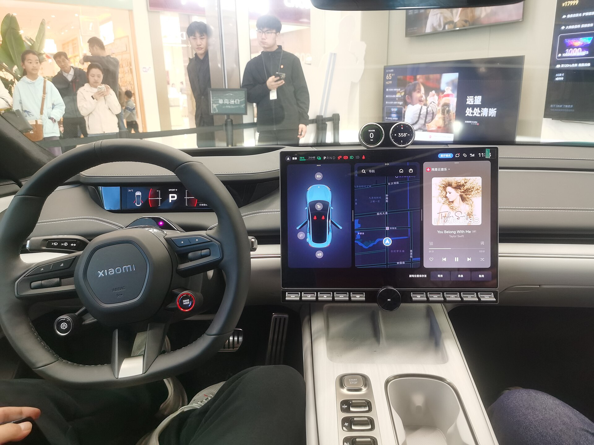

מי היה מאמין שיצרנית הטלפונים החכמים שכולנו מכירים תהפוך תוך שנה אחת לאחת מיצרניות הרכב המדוברות בעולם? **שיאומי SU7** היא סדאן חשמלית ספורטיבית שהשיקה החברה בשוק הסיני, וכבר ברבעונים הראשונים רשמה מספרי מכירות מרשימים שהפתיעו אפילו את המתחרות הוותיקות. הרכב מסמן עידן חדש שבו חברות טכנולוגיה נכנסות לעולם הרכב עם גישה שונה לחלוטין.

## מה זה בעצם שיאומי SU7?

ה-SU7 היא סדאן חשמלית באורך של כ-4.99 מטרים, כלומר בקטגוריית הסדאנים הגדולים — קרובה בממדיה למרצדס CLS מאשר לרכב משפחתי רגיל. העיצוב החלק והאווירודינמי מזכיר לרבים דגמי פורשה, מה שזיכה אותה בכינויים לא מעטים ברשת. **שיאומי SU7** מוצעת בסין בכמה גרסאות: מהדגם הבסיסי עם הנעה אחורית, דרך גרסת Max עם הנעה כפולה, ועד לפצצת הביצועים SU7 Ultra.

מה שמייחד את הרכב אינו רק העיצוב, אלא ה**אקוסיסטם** של שיאומי. מי שכבר מחזיק בטלפון, בשעון או במכשירי בית חכם של החברה, מקבל חוויה מחוברת שבה הרכב הוא עוד רכיב במערכת אחת — כולל הפעלה ותצוגה מסונכרנות בין המכשירים.

## ביצועים: מספרים של רכב-על

כאן שיאומי באמת מפתיעה. גרסת ה-Ultra מצוידת בשלושה מנועים חשמליים המפיקים יחד **הספק של מעל 1,500 כוחות סוס**. מדובר בנתון שמשייך אותה לליגה של רכבי-על, עם זמני האצה מ-0 ל-100 קמ"ש שנמדדים בפחות משתי שניות בגרסאות המובילות. גם הגרסאות ה"רגילות" יותר מציעות ביצועים חזקים בהחלט לשימוש יומיומי.

מבחינת טווח, הדגמים מבוססים על סוללות בקיבולת גדולה שמאפשרות, לפי נתוני היצרן במחזור הסיני, טווח של מאות קילומטרים בטעינה אחת. חשוב לזכור כי מחזורי בדיקה סיניים נוטים להיות אופטימיים, והטווח בפועל בתנאי כביש אמיתיים צפוי להיות נמוך יותר.

## איך היא מתמודדת מול טסלה?

המתחרה הישירה והבלתי נמנעת היא **טסלה מודל 3**, ובמידה מסוימת גם מודל S. שיאומי לא הסתירה שהיא מכוונת בדיוק לשם. הנה השוואה כללית בין הדגמים:

| פרמטר | שיאומי SU7 | טסלה מודל 3 |
|---|---|---|
| קטגוריה | סדאן חשמלית גדולה | סדאן חשמלית בינונית |
| הספק (גרסה עליונה) | מעל 1,500 כ"ס (Ultra) | כ-460 כ"ס (Performance) |
| אורך | כ-4.99 מטר | כ-4.72 מטר |
| אקוסיסטם | חיבור לטלפון ולבית החכם של שיאומי | מערכת סגורה של טסלה |
| זמינות בישראל | לא משווקת רשמית | משווקת רשמית |

היתרון הבולט של טסלה הוא רשת הטעינה המבוססת שלה והניסיון הנצבר, בעוד ששיאומי מביאה עוצמה טכנולוגית וחיבור אקוסיסטם חכם שקשה למצוא אצל המתחרות.

## האם שיאומי SU7 תגיע לישראל?

זו השאלה שמעניינת את הקהל המקומי, והתשובה הכנה היא שנכון להיום **שיאומי SU7 אינה משווקת רשמית בישראל**. שיאומי מתמקדת בשלב זה בשוק הסיני ובהרחבה זהירה לשווקים נבחרים. עם זאת, בהתחשב בגל הרכבים הסיניים ששוטף את ישראל בשנים האחרונות — ובנוכחות המותג בשוק הטלפונים המקומי — אין לפסול אפשרות שהחברה תבחן כניסה גם לתחום הרכב אצלנו בעתיד.

גם אם הדגם לא יגיע בקרוב, המשמעות של ה-SU7 עמוקה יותר: היא מוכיחה שחברת טכנולוגיה יכולה להיכנס לעולם הרכב ולהתחרות ביצרניות ותיקות תוך זמן קצר. זהו סימן לכיוון שאליו נעה התעשייה כולה.

## שורה תחתונה

שיאומי SU7 היא הרבה יותר מעוד חשמלית סינית. היא מייצגת שינוי תפיסתי — רכב שנבנה מתוך עולם הטכנולוגיה והתוכנה, ולא רק מתוך עולם המכניקה המסורתי. גם אם היא עדיין לא זמינה בישראל, כדאי לעקוב אחרי מה שקורה בסין, כי לא מן הנמנע שנראה בקרוב עוד יצרניות טכנולוגיה שמנסות את מזלן על ארבעה גלגלים.
