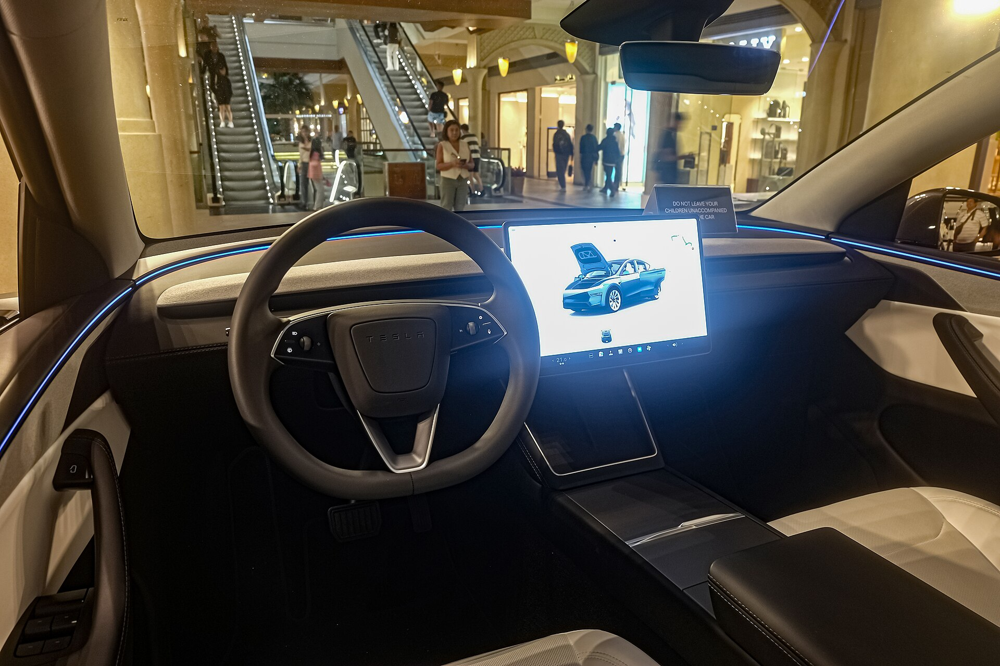

## מה חדש בטסלה מודל Y ג'וניפר?

טסלה מודל Y ג'וניפר היא גרסת הרענון המקיפה של הקרוסאובר החשמלי הנמכר ביותר בעולם, והיא מגיעה לישראל עם שורת שיפורים שנועדו לשמר את הבכורה מול תחרות סינית ואירופית הולכת ומתחזקת. שם הקוד הפנימי, ג'וניפר, מסמן דור שני מרענן שכולל עיצוב חדש בחזית ובאחור, שיפור משמעותי בשקט בתא הנוסעים, ומערכות נוחות מעודכנות — הכל תוך שמירה על היתרונות שהפכו את הדגם ללהיט.

בניגוד לרכב חדש מהיסוד, מדובר בעדכון אמצע-חיים (facelift) חכם. טסלה לקחה את השלד המוכר ושדרגה את מה שהלקוחות ביקרו: איכות הגימור, הרעש בנסיעה, והתחושה הכללית של פנים הרכב.

## עיצוב חיצוני מרענן

החזית קיבלה פס תאורה רציף בסגנון שהושאל מטסלה סייברטראק, המעניק לרכב מבט מודרני ונקי יותר. גם באחורי הרכב יש פנס רוחבי מלא הפורש את שם המותג. מעבר לאסתטיקה, טסלה עבדה על שיפור המקדם האווירודינמי, מה שתורם ליעילות ולטווח.

החישוקים החדשים והצבעים המעודכנים מוסיפים נוכחות, אך המתאר הכללי של הקרוסאובר נשאר מוכר ומזוהה מיד.

## תא נוסעים: שקט ואיכות

כאן מורגש השינוי הגדול ביותר. טסלה הוסיפה **בידוד אקוסטי משופר**, זכוכית כפולה נוספת ואטמים חדשים, כך שהרכב שקט משמעותית במהירויות גבוהות — נקודה שהייתה חולשה ידועה בדגם הקודם. 

מערכת המולטימדיה נשארת סביב מסך מרכזי גדול המנהל כמעט את כל פונקציות הרכב, ולראשונה נוסף מסך אחורי קטן לנוסעי המושב האחורי לשליטה במיזוג ובבידור. חומרי הגימור, התאורה הסביבתית והמושבים המאווררים משדרגים את התחושה לכיוון פרימיום.

## טווח, ביצועים וטעינה

מודל Y ג'וניפר ממשיכה להציע מספר תצורות: גרסת טווח אחורית (הנעה אחורית) וגרסאות הנעה כפולה בעלות ביצועים חזקים יותר. הטווח בגרסאות המובילות מוערך בטווח של **500 עד 600 קילומטר** במחזור הבדיקה האירופי, בהתאם לגרסה ולחישוקים.

יתרון מרכזי נותר הגישה לרשת מגהטעינה (Supercharger) של טסלה, המתרחבת גם בישראל ומאפשרת טעינה מהירה ונוחה בנסיעות ארוכות. תמיכה בהספקי טעינה גבוהים מקצרת משמעותית את זמני העצירה.

## טבלת השוואה: מודל Y ג'וניפר מול הדור הקודם

| פרמטר | מודל Y ג'וניפר | מודל Y (דור קודם) |
|---|---|---|
| עיצוב חזית | פס תאורה רציף חדש | פנסים נפרדים |
| שקט בתא הנוסעים | משופר משמעותית | בינוני |
| מסך אחורי לנוסעים | קיים | לא קיים |
| טווח מוערך (מובילות) | כ-500-600 ק"מ | כ-450-533 ק"מ |
| איכות גימור | משודרגת | סבירה |

## למי מתאימה טסלה מודל Y ג'וניפר?

הדגם מתאים במיוחד למשפחות ישראליות המחפשות **רכב חשמלי משפחתי** מרווח עם תא מטען גדול, חוויית נהיגה מתגמלת ותשתית טעינה נוחה. השיפור בשקט ובאיכות הופך אותה לאטרקטיבית גם למי שהתלבט בעבר בין טסלה לבין מתחרות אירופיות.

מנגד, מי שמעדיף כפתורים פיזיים רבים ופחות תלות במסך מרכזי עשוי להתרשם שהגישה של טסלה עדיין מינימליסטית מדי לטעמו.

## מחיר וזמינות בישראל

המחיר המדויק תלוי במדיניות המס המשתנה על רכבים חשמליים, אך צפוי להתחקם בטווח שממקם את הרכב בין קטגוריית המשפחתיות המבוססות לבין הפרימיום. חשוב לזכור שמס הקנייה על רכבים חשמליים ממשיך במגמת עלייה הדרגתית, ולכן כדאי לבדוק את התמונה העדכנית מול היבואן לפני רכישה.
