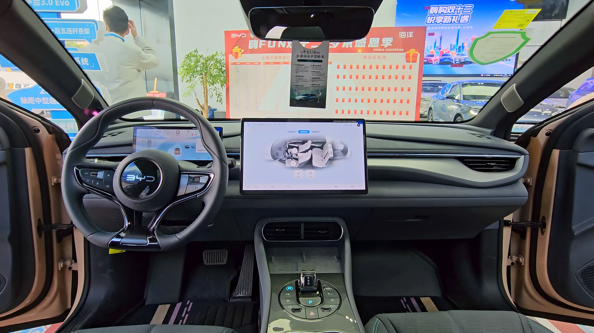

## מה זה BYD סיל ולמי היא מתאימה?

**BYD סיל** היא סדאן חשמלית ספורטיבית מתוצרת יצרנית הרכב הסינית הגדולה, שהגיעה לישראל כדי להתמודד ישירות מול טסלה מודל 3. מדובר ברכב חשמלי לחלוטין, עם עיצוב אווירודינמי זורם, ביצועים מרשימים וטכנולוגיית סוללה ייחודית. אם אתם מחפשים סדאן חשמלי עם נוכחות כביש, שטף נסיעה ותא נוסעים עתיר ציוד — BYD סיל היא שחקנית שחובה להכיר.

הדגם מצטרף לגל הרכבים הסיניים שכובש את השוק הישראלי, אך בניגוד לקרוסאוברים הרבים, סיל מציעה פורמט סדאן נמוך וספורטיבי שהולך ונעשה נדיר.

## עיצוב חיצוני: אווירודינמי ונועז

העיצוב של BYD סיל מבוסס על שפת "Ocean Aesthetics" של היצרנית, עם קווים זורמים בהשראת הים. מקדם הגרר הנמוך (סביב 0.219) תורם ישירות ליעילות ולטווח. הפרטים הבולטים:

- פנסי LED חדים עם חתימת תאורה ייחודית
- ידיות דלת שקועות שנפתחות אוטומטית
- קו גג יורד בסגנון קופה
- חישוקי סגסוגת בגודל 19 אינץ' בגרסאות הגבוהות

מבחינת מידות, הרכב באורך של כ-4.8 מטר — גדול מעט מטסלה מודל 3, מה שמתורגם למרחב פנימי נדיב.

## תא הנוסעים: טכנולוגיה ואיכות

כאן BYD סיל מפתיעה לטובה. איכות החומרים והגימור ברמה גבוהה, עם ריפודים רכים, תפרים דקורטיביים ותחושה יוקרתית שלא תמיד מצפים לה ברכב סיני. במרכז לוח המחוונים ניצב **מסך מגע מסתובב** בגודל 15.6 אינץ' שיכול לעבור ממצב לרוחב למצב לאורך, לצד מסך נהג דיגיטלי נפרד.

הציוד כולל מערכת שמע איכותית, גג זכוכית פנורמי, מושבים חשמליים מחוממים ומאווררים, וטעינה אלחוטית לטלפון. המרחב למושב האחורי טוב, אם כי קו הגג היורד מעט מגביל את מרווח הראש לנוסעים גבוהים.

## ביצועים ונהיגה: מה מרגישים על הכביש?

BYD סיל מגיעה במספר תצורות הנעה. גרסת ההנעה האחורית מציעה חוויה מאוזנת וחסכונית, בעוד **גרסת הביצועים עם הנעה כפולה** (AWD) מזנקת מ-0 ל-100 קמ"ש בסביבות 3.8 שניות בלבד — נתון שמעמיד אותה בשורה אחת עם רכבי ספורט.

בנהיגה בפועל, הרכב מרגיש יציב ונעוץ בכביש, בין היתר הודות למרכז כובד נמוך שמתאפשר בזכות סוללת ה-Blade המשולבת במבנה המרכב. ההיגוי מדויק, המתלים מאוזנים בין נוחות לספורטיביות, והבידוד האקוסטי מצוין.

## סוללה וטווח: עד כמה רחוק מגיעים?

היתרון הטכנולוגי המרכזי של BYD הוא **סוללת ה-Blade** מסוג ליתיום-ברזל-פוספט (LFP), הידועה ביציבות התרמית הגבוהה ובעמידות שלה לאורך זמן. הטווח המוצהר בגרסאות הגבוהות נע סביב 520-570 ק"מ במחזור WLTP, כאשר בנהיגה ישראלית מציאותית ניתן לצפות לטווח מעט נמוך יותר.

תמיכה בטעינה מהירה בזרם ישר מאפשרת הטענה מ-30% ל-80% בטווח זמן של כחצי שעה בעמדות המתאימות.

## טבלת השוואה: BYD סיל מול טסלה מודל 3

| פרמטר | BYD סיל | טסלה מודל 3 |
|---|---|---|
| סוג סוללה | LFP (Blade) | ליתיום לפי גרסה |
| טווח מוצהר (WLTP) | כ-520-570 ק"מ | כ-510-630 ק"מ |
| האצה 0-100 (גרסת ביצועים) | כ-3.8 שניות | כ-3.3-4.4 שניות |
| מסך מרכזי | 15.6 אינץ' מסתובב | 15.4 אינץ' |
| מסך נהג נפרד | יש | אין |
| אורך הרכב | כ-4.8 מ' | כ-4.72 מ' |

## מחיר וזמינות בישראל

BYD סיל מוצעת בישראל במספר רמות גימור, במחיר שמתחרה ישירות בטסלה מודל 3 ובסדאנים חשמליים נוספים. חשוב לזכור כי **מס הקנייה על רכבים חשמליים עולה בהדרגה**, ולכן כדאי לבדוק את המחיר המעודכן מול היבואן. התמורה לכסף נותרת מהגבוהות בקטגוריה, בעיקר בזכות הציוד העשיר והביצועים.

## סיכום: האם כדאי?

BYD סיל היא אחת ההפתעות הגדולות בשוק החשמלי הישראלי. היא מציעה שילוב נדיר של עיצוב נועז, ביצועים מרשימים, טכנולוגיית סוללה מתקדמת ותא נוסעים איכותי — והכול במחיר תחרותי. מי שחיפש אלטרנטיבה לטסלה מודל 3, מצא כעת מועמדת רצינית במיוחד.
