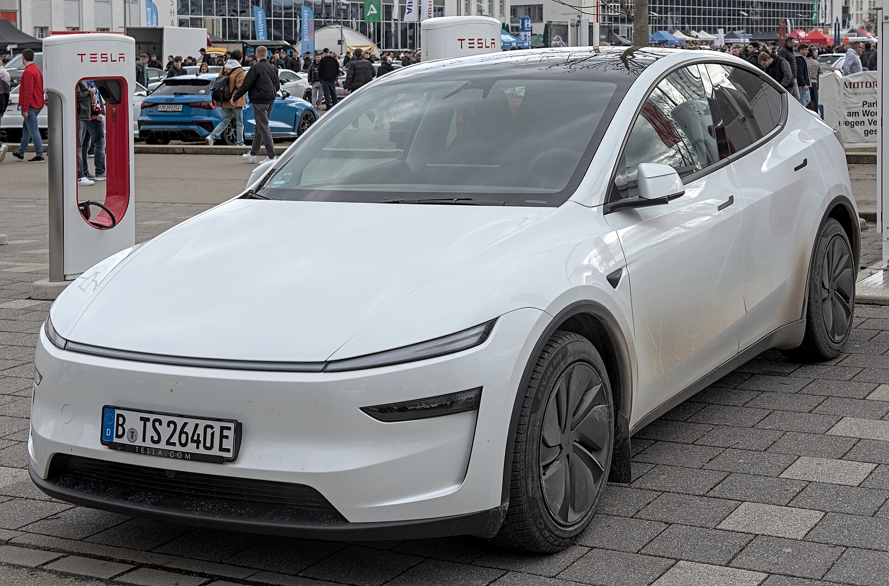

## מה חדש בטסלה מודל Y Juniper?

**טסלה מודל Y** בגרסת הדור המרענן, המכונה בשם הפנימי "Juniper", מביאה שדרוג מקיף לקרוסאובר החשמלי הנמכר בעולם — עיצוב חזית ואחור חדשים, בידוד אקוסטי משופר, תא נוסעים מעודכן וטווח נהיגה גדול יותר. מדובר בעדכון אמצע-חיים משמעותי שנועד לשמור על טסלה מודל Y בחזית השוק מול גל התחרות, בעיקר מצד היצרניות הסיניות.

השינוי הבולט ביותר הוא בחזות. טסלה אימצה פס תאורה רציף בחזית ובחלק האחורי, קווי גוף מחודדים יותר ומראה בוגר ומודרני. התוצאה היא רכב שנראה פחות "עגלגל" ויותר מלוטש, קרוב יותר באופיו למודל 3 המרענן.

## עיצוב פנים: שקט, נקי ומשודרג

בתוך תא הנוסעים מרגישים מיד את ההשקעה בשדרוג. **הבידוד האקוסטי** הוא אולי השיפור המורגש ביותר — זכוכית עבה יותר וטיפול ברעשי דרך הופכים את הנסיעה לשקטה באופן ניכר, תחום שבו הדור הקודם נחשב בינוני.

החומרים בתא שודרגו, הוסף תאורת אווירה היקפית, והמושבים האחוריים קיבלו מסך מגע נפרד לבקרת מיזוג ומולטימדיה. המסך המרכזי נותר במרכז הבמה, מהיר ומגיב, ומערכת ההפעלה של טסלה ממשיכה להוביל בחוויית המשתמש, בעדכוני אוויר ובניווט מבוסס טעינה.

### מרחב פנים ותא מטען

מודל Y ממשיך להיות מרווח במיוחד למידותיו, עם תא מטען אחורי גדול, תא קדמי (frunk) נוסף ומושב אחורי מתקפל בחלוקה. עבור משפחה ישראלית מדובר בפתרון פרקטי לחופשות, לקניות ולשגרה.

## טווח, ביצועים וטעינה

הטווח המוצהר בדור המרענן עלה קלות, ונע לפי הגרסה בטווח משוער של **500 עד 600 ק"מ** במחזור WLTP. בפועל, כמו בכל רכב חשמלי, הטווח האמיתי תלוי במהירות, במזג האוויר ובסגנון הנהיגה.

טסלה מודל Y נהנית מרשת העל-מטענים (Superchargers) של טסלה, שמתרחבת גם בישראל ומציעה טעינה מהירה ונוחה. בטעינה מהירה בזרם ישר ניתן להוסיף טווח משמעותי בזמן קצר, ומשאבת החום המובנית מסייעת לשמר טווח גם בחורף.

## טבלת השוואה: דור מרענן מול דור קודם

| פרמטר | מודל Y Juniper (מרענן) | מודל Y (דור קודם) |
|---|---|---|
| עיצוב חוץ | פס תאורה רציף חדש, קווים מחודדים | חזית עגולה קלאסית |
| בידוד אקוסטי | משופר משמעותית | בינוני |
| מסך אחורי | קיים | לא קיים |
| טווח (הערכה) | כ-500-600 ק"מ | כ-455-565 ק"מ |
| חומרי פנים | משודרגים, תאורת אווירה | סטנדרטיים |

## למי מתאימה טסלה מודל Y החדשה?

טסלה מודל Y Juniper מתאימה למי שמחפש קרוסאובר חשמלי משפחתי עם טווח רחב, מערכת מולטימדיה מתקדמת וגישה לרשת טעינה אמינה. השדרוג באיכות הנסיעה ובשקט הופך אותה לנוחה בהרבה לנסיעות ארוכות, והיא ממשיכה להציע את יתרון התוכנה והעדכונים המתמשכים של טסלה.

מנגד, התחרות בישראל חריפה מאי פעם — דגמים כמו סקודה אניאק, קיה EV6 ומגוון רכבים סיניים מציעים אלטרנטיבות מפתות. עם זאת, השילוב של מותג, רשת טעינה וערך מכירה חוזרת שומר על מודל Y כאופציה מובילה.

### נקודות לבדיקה לפני רכישה

- **גרסה**: בחרו בין הנעה אחורית לגרסת הכפולה (Dual Motor) לפי צורכי הטווח והביצועים.
- **צבע וריפוד**: חלק מהאפשרויות כרוכות בתוספת תשלום.
- **טעינה ביתית**: כדאי לתכנן התקנת עמדת טעינה להטענה לילית נוחה.
- **אחריות סוללה**: בדקו את תנאי האחריות ואת מדיניות שימור הקיבולת.

## סיכום

הדור המרענן של **טסלה מודל Y** אינו מהפכה אלא זיקוק מדויק של נוסחה מצליחה: עיצוב בוגר יותר, נסיעה שקטה בהרבה, פנים משודרגים וטווח משופר. עבור הקהל הישראלי המחפש חשמלית משפחתית מאוזנת, זהו שדרוג שמחזק את מעמדה של המכונית בראש טבלת המכירות.
