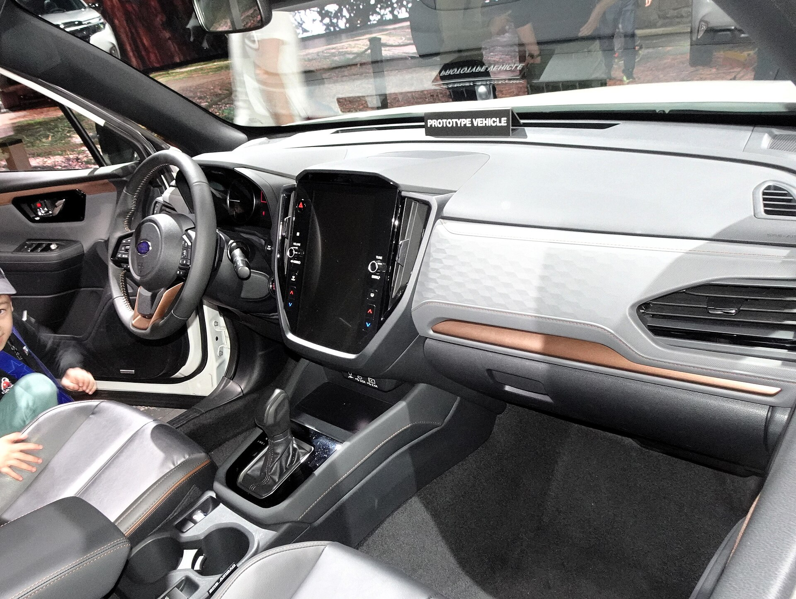

סובארו פורסטר החדש חוזר לשוק הישראלי עם מתכון מוכר אך משודרג: הנעה כפולה סימטרית קבועה, מערכת היברידית מעודכנת ויכולת שטח אמיתית שמבדילה אותו מרוב הקרוסאוברים העירוניים. אם אתם מחפשים רכב משפחתי שמרגיש בטוח בכביש אבל לא מתבייש בדרך עפר — הפורסטר נשאר אחת התשובות הרלוונטיות ביותר, במיוחד לקהל שגר מחוץ למרכז או נוסע הרבה בשבילים.

## למה סובארו פורסטר עדיין רלוונטי בישראל?

בשוק שמוצף בקרוסאוברים חזותיים שמעולם לא יראו שביל עפר, סובארו פורסטר מציע משהו נדיר: **יכולת שטח אמיתית** ללא צורך בטרקטורון כבד. ההנעה הכפולה הקבועה, מרווח הגחון הגבוה (סביב 22 ס"מ) וזוויות הגישה הנדיבות הופכים אותו למועמד טבעי למטיילים, חקלאים ומשפחות באזורי הפריפריה.

הדור החדש שומר על הקו השמרני-פרקטי של הדגם, אך מביא עיצוב מרובע וחסון יותר, פנסים חדים ותא נוסעים מרווח במיוחד. זהו לא רכב שמנסה להרשים במבט ראשון — אלא כזה שמוכיח את עצמו לאורך זמן.

## איך זה מרגיש בנהיגה?

על הכביש, הפורסטר מתנהג בבגרות. המתלים מכוילים לנוחות, הבולם זעזועים בולע מהמורות בעדינות, והישיבה הגבוהה מעניקה שדה ראייה מצוין — יתרון אמיתי בנהיגה עירונית צפופה. ההגה מדויק אך לא ספורטיבי, וזה בסדר גמור עבור אופי הרכב.

המנוע ה**בוקסר** האופקי, סימן ההיכר של סובארו, תורם למרכז כובד נמוך ולתחושת יציבות בפניות. בשילוב ההנעה הכפולה הסימטרית, הרכב מרגיש נטוע לכביש גם בתנאי מזג אוויר קשים — גשם, בוץ או חצץ.

### ומה עם השטח?

כאן הפורסטר באמת זורח. מערכת ה-X-Mode מתאימה את תגובת המנוע וההנעה לתנאי שטח משתנים, ובקרת ירידה במדרון מאפשרת לרדת בשבילים תלולים בביטחון. זו לא יכולת שיווקית בלבד — היא עובדת.

## הגרסה ההיברידית — כמה היא חוסכת?

סובארו משלבת בפורסטר החדש מערכת היברידית מעודכנת שמטרתה לרכך את אחת מנקודות התורפה ההיסטוריות של הדגם: צריכת דלק גבוהה יחסית. המערכת מסייעת למנוע הבנזין בעיקר בנהיגה עירונית, בהאצות קלות ובעצירות ויסועים, ומצמצמת בצורה מורגשת את ההוצאה על דלק בעיר.

חשוב להבין — מדובר במערכת היברידית שמטרתה העיקרית היא יעילות וחלקות, לא ביצועים. מי שמצפה לזינוק ספורטיבי ימצא רכב רגוע ומדוד, אך מי שמחפש חיסכון וביטחון ייהנה מהאיזון.

## השוואה: סובארו פורסטר מול מתחרים בולטים

| פרמטר | סובארו פורסטר | טויוטה ראב4 | מאזדה CX-5 |
|---|---|---|---|
| הנעה כפולה | סימטרית קבועה | לפי דרישה | לפי דרישה |
| יכולת שטח | גבוהה | בינונית-גבוהה | בינונית |
| מערכת הנעה | היברידי + בוקסר | היברידי | בנזין/מילד-היברידי |
| דגש עיקרי | שטח ובטיחות | חסכנות ואמינות | עיצוב ונהיגה |
| מרווח גחון | גבוה מאוד | בינוני | נמוך יחסית |

## בטיחות — איפה סובארו תמיד הובילה

מערכת הבטיחות **אייסייט** של סובארו נחשבת לאחת המקיפות בשוק. היא כוללת בלימת חירום אוטומטית, בקרת שיוט אדפטיבית, שמירת נתיב, זיהוי הולכי רגל ועוד. סובארו זוכה באופן עקבי בציונים גבוהים במבחני ההתרסקות הבינלאומיים, והפורסטר ממשיך את המסורת הזו.

למשפחות עם ילדים, זהו שיקול משמעותי — תחושת הביטחון שהרכב מספק היא מוחשית.

## יתרונות וחסרונות

**יתרונות:**
- הנעה כפולה סימטרית קבועה ויכולת שטח אמיתית
- מערכת בטיחות אייסייט מקיפה
- תא נוסעים מרווח ונוחות נסיעה גבוהה
- אמינות מכנית מוכחת לאורך שנים

**חסרונות:**
- מחיר גבוה יחסית למתחרים
- ביצועים מדודים ולא ספורטיביים
- עיצוב שמרני שלא לכל טעם

## למי מתאים סובארו פורסטר?

הפורסטר החדש מתאים בול למי שמחפש רכב משפחתי אמין, בטוח ובעל יכולת שטח אמיתית — מבלי להתפשר על נוחות יומיומית. הוא פחות מתאים למי שמחפש חוויית נהיגה ספורטיבית או עיצוב נועז, ויותר למי שמעריך פרקטיות, ביטחון ושקט נפשי לאורך שנים.
