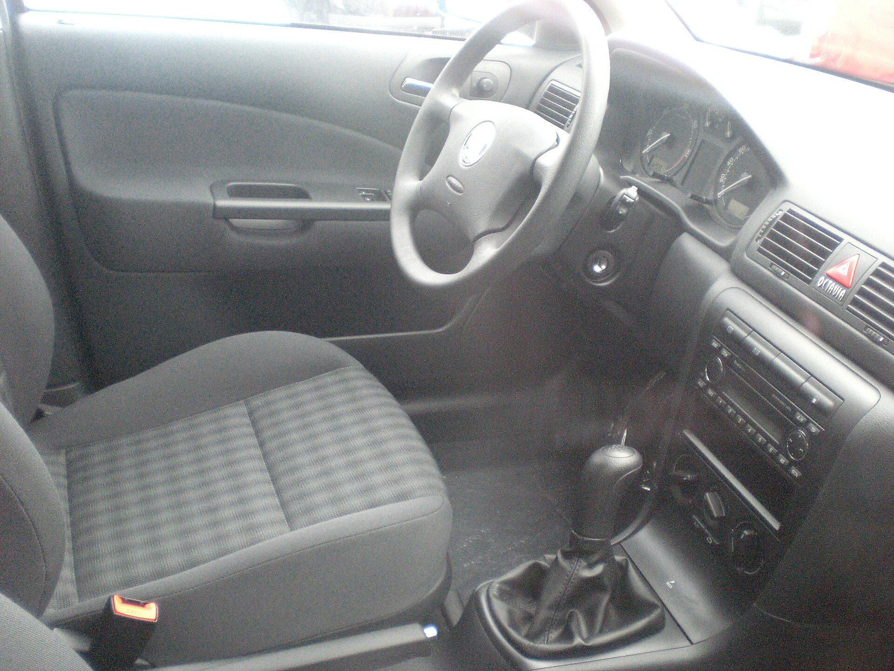

## האם סקודה אוקטביה עדיין המשפחתית החכמה בישראל?

סקודה אוקטביה ממשיכה להיות אחת המשפחתיות הפופולריות והמשתלמות בשוק הישראלי, והדור המעודכן שלה מחדד בדיוק את מה שהפך אותה להצלחה: מרחב פנימי נדיב, חסכון בדלק, בטיחות גבוהה ותחושת איכות שגבוהה ממחירה. במבחן הדרך שלנו גילינו שאוקטביה לא מנסה להרשים בראוותנות — היא פשוט עושה הכל נכון, וזה בדיוק מה שמשפחה ישראלית מחפשת.

האוקטביה מגיעה בישראל גם כסדאן-ליפטבק וגם כסטיישן (קומבי), והיא ממצבת את עצמה בין המשפחתיות הקומפקטיות לבינוניות — עם מידות שמתקרבות לדרגה גבוהה יותר אך במחיר נגיש יחסית.

## עיצוב חיצוני: שמרני אך מהוקצע

העיצוב של אוקטביה נשאר נקי ומאופק, עם קווים ישרים, מסבך קדמי רחב ופנסי לד חדים. זו לא מכונית שצועקת לתשומת לב, אבל היא מזדקנת יפה ושומרת על מראה רציני ומכובד. גרסת הסטיישן, עם הגג המתארך, נתפסת בעיני רבים כאלגנטית אף יותר מהליפטבק.

## מרחב פנימי: כאן אוקטביה מנצחת

היתרון הגדול ביותר של סקודה אוקטביה הוא המרחב. תא הנוסעים האחורי מציע מרחב רגליים וראש מהטובים בקטגוריה, ושלושה מבוגרים ישבו מאחור בלי להתלונן. תא המטען עצום — בגרסת הסטיישן מדובר בנפח שמתחרה ברכבי שטח גדולים בהרבה.

סקודה ממשיכה עם פילוסופיית ה"סימפלי קלבר" — פתרונות אחסון חכמים כמו מגרד שלג מובנה, מחזיק כרטיסים, רשתות ותאים נסתרים שהופכים את החיים לנוחים יותר. איכות החומרים טובה, והמסך המרכזי הגדול משתלב במערכת מולטימדיה אינטואיטיבית יחסית.

## מנועים וביצועים: איזון מעל הכל

בישראל מוצעת אוקטביה בעיקר עם מנוע בנזין טורבו בנפח 1.5 ליטר, המחובר לתיבת הילוכים אוטומטית דו-מצמדית. זהו שילוב מוכר ומוכח מבית קבוצת פולקסווגן, שמספק תאוצה חלקה ובטוחה לנהיגה יומיומית, עם צריכת דלק נמוכה יחסית הודות למערכת ניתוק צילינדרים.

על הכביש אוקטביה מרגישה יציבה ובטוחה. המתלים מכוילים לנוחות בלי לאבד שליטה בפניות, וההגה מדויק אם כי לא ספורטיבי במיוחד. זו מכונית נסיעה ארוכה אידיאלית — שקטה, יציבה וחסכנית בכביש פתוח.

## צריכת דלק: מהחסכניות בקטגוריה

במבחן המשולב שלנו, הכולל עיר ובין-עירוני, אוקטביה הפגינה צריכת דלק נמוכה שמתקרבת לנתוני היצרן. זהו אחד מגורמי המשיכה המרכזיים שלה עבור נהגים שעושים קילומטראז' גבוה.

## טבלת השוואה: סקודה אוקטביה מול מתחרות

| פרמטר | סקודה אוקטביה | טויוטה קורולה | סקודה סופרב |
|---|---|---|---|
| קטגוריה | משפחתית בינונית | משפחתית קומפקטית | משפחתית גדולה |
| נפח תא מטען | גדול מאוד | בינוני | ענק |
| מנוע עיקרי | בנזין טורבו 1.5 | היברידי | בנזין טורבו |
| חסכון בדלק | מצוין | מצוין (היברידי) | טוב |
| מיצוב מחיר | תחרותי | תחרותי | גבוה יותר |

## בטיחות ומערכות סיוע

אוקטביה מצוידת במגוון רחב של מערכות בטיחות וסיוע לנהג, הכוללות בלימת חירום אוטונומית, בקרת שיוט אדפטיבית, שמירת נתיב וזיהוי הולכי רגל. דירוג הבטיחות של הדגם במבחני התרסקות אירופיים נותר גבוה, מה שהופך אותה לבחירה בטוחה למשפחה.

## למי מתאימה סקודה אוקטביה?

אוקטביה היא הבחירה המושלמת למי שמחפש משפחתית מרווחת, חסכנית ובטוחה — בלי לשלם על יוקרה מוגזמת. היא לא הרכב הכי מרגש בכביש, אבל היא ככל הנראה אחד ההגיוניים ביותר. אם אתם שוקלים ביניים בין רכב קומפקטי לגדול, אוקטביה נותנת לכם את המרווח של הגדול במחיר קרוב יותר לקומפקטי.
