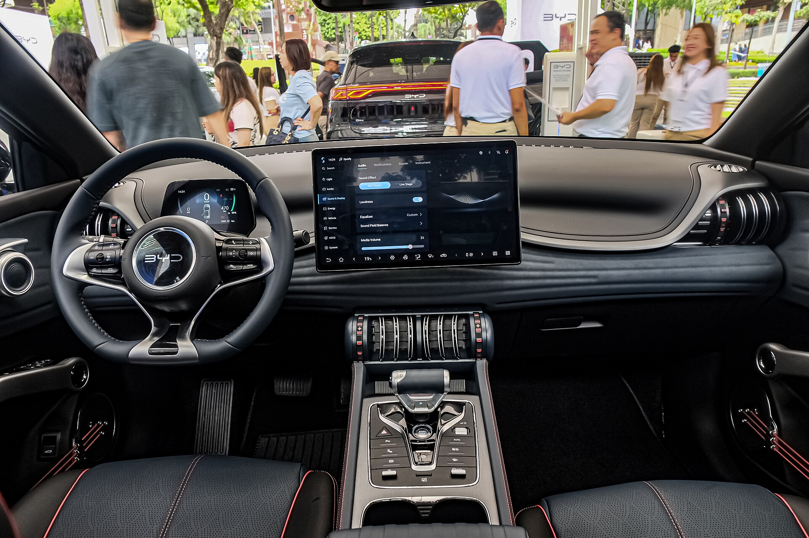

## מה הופך את BYD אטו 3 ללהיט בישראל?

ה-**BYD אטו 3** הוא קרוסאובר חשמלי קומפקטי שהפך בתוך זמן קצר לאחד הרכבים החשמליים הנמכרים בישראל, בזכות שילוב של טווח נדיב, ציוד עשיר ומחיר תחרותי. בשורה התחתונה: זהו רכב משפחתי חשמלי שמציע הרבה ערך תמורת הכסף, גם אם הוא לא מושלם בכל פרמטר. במבחן הדרך שלנו ניסינו להבין האם הפופולריות מוצדקת, ואיפה עדיין יש מקום לשיפור.

## עיצוב חיצוני — נוכחות שקטה

האטו 3 מציג קווים מעוגלים ונעימים לעין, בלי לנסות להיות אגרסיבי מדי. החזית נקייה, הפנסים דקים והפרופיל הצידי מזכיר קרוסאוברים אירופיים מוכרים. המידות הקומפקטיות (אורך של כ-4.45 מטר) הופכות אותו לנוח לחניה בעיר, אך עדיין עם נפח פנימי מכובד.

## פנים הרכב — הפתעה לטובה

כאן האטו 3 באמת מפתיע. תא הנוסעים מרגיש מרווח ועשיר, עם חומרים נעימים למגע ועיצוב יצירתי שכולל פרטים "מוזיקליים" (כמו רצועות דמויות מיתרי גיטרה בכיסי הדלתות). במרכז בולט **מסך מגע מסתובב** בגודל 12.8 אינץ', שניתן לסובב בין תצוגה אופקית לאנכית — גימיק מגניב שגם שימושי.

מערכת המולטימדיה תומכת ב-אפל קארפליי ו-אנדרואיד אוטו, ויש מערכת שמע סבירה. עם זאת, חלק מהתפריטים מורכבים ודורשים התרגלות, ולעיתים פעולות בסיסיות מוסתרות בתוך תת-תפריטים.

## טווח, סוללה וטעינה

האטו 3 מצויד בסוללת **Blade** ייחודית של BYD מסוג ליתיום-ברזל-פוספט (LFP), הנחשבת לעמידה ובטוחה יחסית בפני התחממות. הקיבולת עומדת על כ-60 קוט"ש, והטווח המוצהר הוא כ-420 ק"מ במחזור WLTP. בשימוש מעורב ישראלי, סביר לצפות לטווח מעשי של כ-330–380 ק"מ, בהתאם לסגנון הנהיגה ולשימוש במזגן.

בטעינה מהירה בזרם ישר הרכב תומך בהספק של עד כ-88 קילוואט, שמאפשר טעינה מ-30% ל-80% בכ-30–40 דקות. זה לא השיא בקטגוריה, אבל מספק לרוב הנהגים.

## ביצועים ותחושת נהיגה

המנוע החשמלי מפיק כ-204 כוחות סוס ומאיץ מ-0 ל-100 קמ"ש בכ-7.3 שניות — יותר ממספק לנהיגה יומיומית. ההאצה חלקה ושקטה, והרכב נעים במיוחד בעיר. במהירויות גבוהות ובכבישים מתפתלים מורגשת נטייה קלה להתנדנדות, והמתלים מכוונים לנוחות יותר מאשר לספורטיביות.

ההיגוי קל ומדויק דיו לעיר, אך חסר תחושת כביש עשירה. בסך הכול מדובר ברכב נינוח ורגוע — בדיוק מה שרוב הקונים מחפשים ברכב משפחתי חשמלי.

## בטיחות וציוד

האטו 3 מגיע עם חבילת מערכות בטיחות עשירה הכוללת בלימה אוטונומית, שמירת נתיב, בקרת שיוט אדפטיבית, ניטור שטחים מתים וזיהוי הולכי רגל. הרכב זכה בדירוג חמישה כוכבים במבחני Euro NCAP, מה שמחזק את תחושת הביטחון.

## טבלת השוואה: BYD אטו 3 מול מתחרות

| פרמטר | BYD אטו 3 | MG ZS EV | סקודה אלרוק |
|---|---|---|---|
| הספק (כ"ס) | ~204 | ~177 | ~204 |
| טווח WLTP | ~420 ק"מ | ~440 ק"מ | ~425 ק"מ |
| קיבולת סוללה | ~60 קוט"ש | ~64 קוט"ש | ~63 קוט"ש |
| טעינה מהירה | עד ~88 קילוואט | עד ~92 קילוואט | עד ~125 קילוואט |
| אופי | משפחתי נינוח | פרקטי | אירופי מהוקצע |

## למי מתאים BYD אטו 3?

האטו 3 מתאים למי שמחפש **רכב חשמלי משפחתי** בתקציב סביר, עם ציוד עשיר, טווח מספק לשימוש יומיומי ותחושת ביטחון גבוהה. הוא פחות יתאים למי שמחפש חוויית נהיגה ספורטיבית או מהוקצעת ברמה אירופית.

בשורה התחתונה, ה-BYD אטו 3 מצדיק את הפופולריות שלו בישראל. הוא לא מושלם, אבל הוא מציע חבילה כוללת משכנעת במחיר שקשה להתעלם ממנו.
