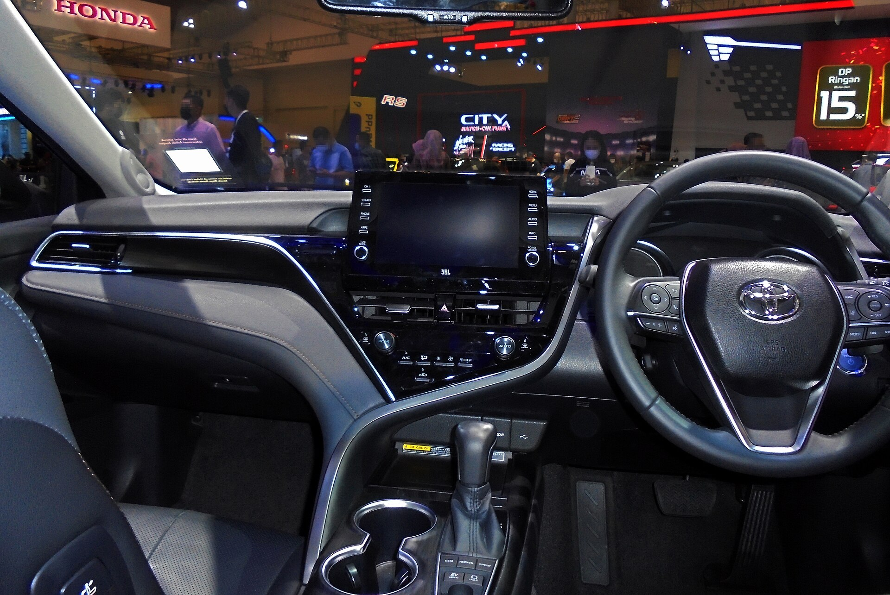

## האם טויוטה קאמרי היברידי עדיין רלוונטית בישראל?

בעידן שבו כולם רצים לקנות קרוסאוברים גבוהים, **טויוטה קאמרי היברידי** מזכירה לנו למה סדאן משפחתי טוב עדיין שווה מבט. התשובה הקצרה: אם אתם עושים הרבה קילומטרים, מחפשים נוחות ושקט נהיגה וצריכת דלק נמוכה במיוחד — זו עדיין אחת ההצעות ההגיוניות בשוק. קאמרי היברידי משלבת מנוע בנזין אטקינסון עם מערכת הנעה חשמלית, ומספקת חוויית נהיגה חלקה שמרגישה בוגרת ורגועה.

יצאנו לכביש הישראלי כדי לבדוק אם הדור החדש של הסדאן המוכר מצליח לשמר את המוניטין שלו כבחירה חכמה למשפחה ולנוסע הכבד.

## נהיגה וביצועים: חלק, שקט ורגוע

ההנעה ההיברידית של קאמרי היא הלב של החוויה. בנסיעה עירונית הרכב נע לא פעם על חשמל בלבד, מה שמתורגם לשקט כמעט מוחלט ולתחושת נעימות אמיתית בפקקים. כשצריך תאוצה — מנוע הבנזין מצטרף בצורה חלקה, והמעבר כמעט בלתי מורגש.

תיבת ההילוכים מסוג רציף (CVT) מכוונת לנוחות ולא לספורטיביות, וזה בסדר גמור עבור קהל היעד. במהירויות כביש מהיר הקאמרי יציבה, שקטה ובולעת מהמורות בביטחון. זה לא רכב שמזמין אותך לנהיגה אגרסיבית, אלא כזה שגורם לך להגיע ליעד רגוע ונינוח.

### צריכת דלק — כאן הקאמרי מבריקה

היתרון הגדול של **טויוטה קאמרי היברידי** הוא החיסכון. בנהיגה עירונית ומעורבת ניתן להגיע לצריכת דלק נמוכה במיוחד ביחס לגודל הרכב, ובנסיעות בינעירוניות ארוכות המערכת ההיברידית ממשיכה להפתיע לטובה. עבור נהג שעושה קילומטראז' גבוה, זהו הבדל משמעותי בהוצאה החודשית.

## פנים הרכב: מרווח, נוח ומעודכן

תא הנוסעים של קאמרי מציע מרחב נדיב, בעיקר במושב האחורי שבו גם נוסעים גבוהים יישבו בנוחות. המושבים הקדמיים תומכים היטב בנסיעות ארוכות, והגימור נעים למגע עם תחושת איכות סבירה לקטגוריה.

מערכת המולטימדיה עודכנה עם מסך מרכזי גדול ותמיכה בחיבור אלחוטי לאפל קארפליי ואנדרואיד אוטו. תא המטען גדול ושימושי, אם כי השימוש בסדאן פחות גמיש מקרוסאובר בכל הנוגע להעמסת חפצים גבוהים.

## בטיחות: חבילה עשירה כסטנדרט

טויוטה ממשיכה להצטיין בתחום הבטיחות. הקאמרי מגיעה עם מערך מערכות סיוע לנהג הכולל בלימת חירום אוטומטית, בקרת שיוט אדפטיבית, שמירת נתיב והתרעת נקודה מתה. זהו מערך שמעניק ביטחון אמיתי בנהיגה היומיומית ומחזק את מעמד הרכב כבחירה משפחתית אחראית.

## טבלת השוואה: קאמרי היברידי מול מתחרים

| פרמטר | טויוטה קאמרי היברידי | סדאן משפחתי מתחרה | קרוסאובר היברידי משפחתי |
|---|---|---|---|
| סוג הנעה | היברידי מלא | בנזין/היברידי | היברידי מלא |
| צריכת דלק | נמוכה מאוד | בינונית | נמוכה-בינונית |
| נוחות ושקט | גבוהה מאוד | בינונית-גבוהה | גבוהה |
| גובה נהיגה/כניסה | נמוך | נמוך | גבוה |
| נפח תא מטען | גדול | גדול | משתנה |
| אופי כללי | רגוע ונוח | מגוון | פרקטי-גמיש |

## למי מתאימה טויוטה קאמרי היברידי?

הקאמרי מתאימה במיוחד למי שמחפש **רכב משפחתי נוח, שקט וחסכוני** לנסועה גבוהה — נהגי נתיבים, אנשי מכירות, משפחות שעושות הרבה כביש בין-עירוני ומי שפשוט מעריך חוויית נהיגה רגועה. מי שמעדיף ישיבה גבוהה וגמישות של תא מטען פתוח כנראה ימצא את עצמו מסתכל לכיוון קרוסאובר, אך מבחינת נוחות טהורה ושקט — הקאמרי עדיין מנצחת רבים מהם.

## שורה תחתונה

טויוטה קאמרי היברידי היא תזכורת מרעננת לכך שסדאן איכותי לא יצא מהאופנה. היא לא מנסה להרשים בעיצוב דרמטי או בביצועים ספורטיביים, אלא עושה את העבודה בצורה מושלמת: חוסכת בדלק, מפנקת בנוחות ושומרת על רוגע בכל נסיעה. עבור הקהל הנכון — זו אחת העסקאות ההגיוניות בשוק.
