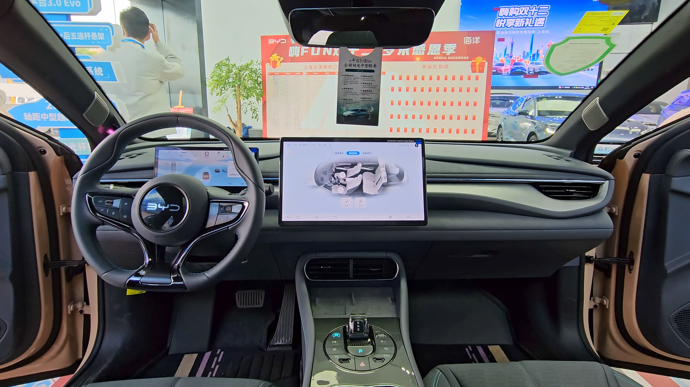

## מה הופך את ה-BYD Seal למעניינת כל כך?

ה-BYD Seal היא סדאן חשמלית ספורטיבית שהגיעה לישראל כדי לאתגר ישירות את טסלה מודל 3, והיא עושה זאת בצורה משכנעת. מדובר ברכב חשמלי עם עיצוב אווירודינמי נועז, ביצועים מרשימים וטכנולוגיית סוללת Blade הייחודית של היצרנית הסינית. אם חיפשתם סדאן חשמלית שמשלבת סטייל, טווח נדיב ותחושת נהיגה ספורטיבית — ה-BYD Seal בהחלט ראויה לתשומת לב.

ביואייD, שהפכה לאחת מיצרניות הרכב החשמלי הגדולות בעולם, מציבה את ה-Seal כדגל טכנולוגי. בניגוד לדגמים זולים יותר כמו האטו 3, הסיל נבנתה על פלטפורמת e-Platform 3.0 המתקדמת, עם מבנה שבו הסוללה משולבת כחלק מהשלדה (Cell-to-Body) — מה שמשפר את הקשיחות ואת תחושת הכביש.

## עיצוב חיצוני: אוקיינוס של השראה

שפת העיצוב של ביואייD נקראת "Ocean Aesthetics", וה-Seal היא אולי הביטוי היפה ביותר שלה. הקווים הזורמים, הפנסים הדקים והגג המשופע יוצרים צללית אלגנטית עם מקדם גרר אווירודינמי נמוך במיוחד של כ-0.219 — נתון שתורם ישירות לטווח ולחיסכון באנרגיה.

ידיות הדלתות השקועות, החישוקים האירודינמיים והפרופורציות המאוזנות משדרים בשלות עיצובית שלא תמיד ראינו ביצרנים סינים בעבר. זו מכונית שנראית יקרה יותר ממה שהיא באמת.

## פנים הרכב: איכות שמפתיעה

בתא הנוסעים ממשיכה ההפתעה החיובית. חומרי הגימור רכים ואיכותיים, הריפוד נעים והמסך המרכזי המסתובב בגודל כ-15 אינץ' (שניתן לסובב בין תצוגה אופקית לאנכית) הפך לסימן ההיכר של המותג. מאחוריו ניצב צג דיגיטלי לנהג בגודל כ-10 אינץ'.

המולטימדיה מגיבה בזריזות, אך הממשק עדיין דורש התרגלות, בעיקר בכל הנוגע לניהול מערכות הבטיחות דרך התפריטים. מרחב הראש מאחור מעט מוגבל בשל קו הגג המשופע, אך מרחב הרגליים נדיב בזכות בסיס הגלגלים הארוך.

## טווח, סוללה וטעינה

בלב ה-BYD Seal פועמת סוללת Blade — טכנולוגיית ליתיום-ברזל-פוספט (LFP) שמצטיינת בבטיחות גבוהה, עמידות לאורך זמן ועמידות טובה יותר בטמפרטורות גבוהות, יתרון בולט לקיץ הישראלי. הסוללה בעלת קיבולת של כ-82.5 קוט"ש בגרסאות המובילות.

הטווח המוצהר (מחזור WLTP) נע סביב 520 ק"מ בגרסת ההנעה האחורית היחידה, ומעט פחות בגרסת ההנעה הכפולה. בפועל, בנהיגה ישראלית מעורבת, סביר לצפות לטווח אמיתי של כ-400-450 ק"מ. בטעינה מהירה בזרם ישר, הסיל תומכת בהספק של עד כ-150 קילוואט, שמאפשר טעינה מ-30% ל-80% בכ-26 דקות בתנאים אופטימליים.

## ביצועים: ספורטיבית באמת

כאן ה-Seal באמת מבריקה. גרסת ההנעה הכפולה (AWD) מפיקה הספק כולל של מעל 500 כוחות סוס ומאיצה מ-0 ל-100 קמ"ש בכ-3.8 שניות בלבד — נתון על חשמלי. גם גרסת ההנעה האחורית אינה מביכה, עם האצה של כ-5.9 שניות.

מערכת המתלים וניהול משקל הסוללה הנמוך תורמים למרכז כובד נמוך ולתחושת יציבות גבוהה בפניות. ההיגוי מדויק, גם אם מעט מנותק, והנהיגה שקטה ומעודנת.

## BYD Seal מול טסלה מודל 3: טבלת השוואה

| פרמטר | BYD Seal | טסלה מודל 3 |
|---|---|---|
| סוג סוללה | Blade (LFP) | ליתיום-יון / LFP |
| טווח מוצהר (WLTP) | כ-520 ק"מ | כ-513-629 ק"מ |
| האצה 0-100 (גרסה מובילה) | כ-3.8 שניות | כ-3.3-4.4 שניות |
| מסך מרכזי | כ-15 אינץ' מסתובב | כ-15.4 אינץ' |
| צג לנהג | יש | אין (מידע במסך המרכזי) |
| הספק טעינה מהירה | עד כ-150 קילוואט | עד כ-170-250 קילוואט |

## למי מתאימה ה-BYD Seal?

ה-BYD Seal מתאימה למי שמחפש סדאן חשמלית עם אופי ספורטיבי, עיצוב בולט ואיכות גימור שמתחרה בקטגוריות גבוהות יותר — מבלי לשלם מחיר פרימיום מלא. היא פחות מתאימה למשפחות שזקוקות למרחב ראש מקסימלי מאחור או לתא מטען בגודל קרוסאובר.

בשוק הישראלי, שבו רכבים חשמליים מסין צוברים תאוצה אדירה, ה-Seal ממצבת את עצמה כאחת ההצעות המשכנעות ביותר בקטגוריית הסדאנים. היא מוכיחה שהמותגים הסינים כבר לא מתחרים רק על מחיר — אלא גם על איכות, טכנולוגיה וחוויית נהיגה.
